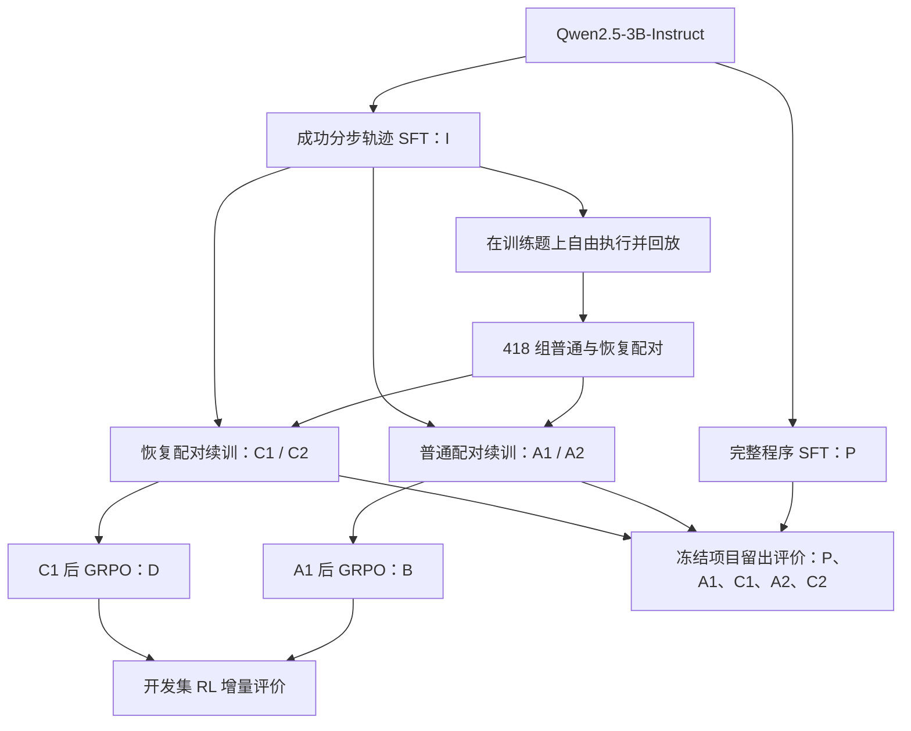

# 小模型 Agent 训练与 Agentic RL：项目技术详解、结果和简历表达

更新日期：2026-10-08。依据当前仓库的实现、冻结协议和已完成运行记录整理。

本文用于理解项目、准备简历和面试。它说明实际做过的工作，不把原计划、示意样例或没有得到支持的假设写成成果。阅读顺序建议：先读第 1—3 节理解全貌，再读第 4—12 节掌握训练和实验，最后使用第 16—17 节准备表达。

**核心事实：主方法是恢复轨迹监督微调（SFT），强化学习采用已有 GRPO，是完成了真实参数更新的辅助对照。公开项目留出集上已得到支持的主要收益来自恢复 SFT；本轮短程 RL 没有显示稳定的额外收益。**

## 1. 这个项目究竟在解决什么问题

任务是知识图谱问答：输入自然语言问题，由语言模型生成可执行操作，在知识库中查询，最后返回答案。

例如，问题可能需要先找实体，再筛选属性或限定条件，最后计数或比较。模型必须决定调用什么工具、传什么参数，以及引用前面哪一步的结果。一次合法的工具调用不一定符合题意；某一步选错之后，模型还可能反复尝试错误操作，直到用完预算。

训练问题由此产生：**通常的正确轨迹 SFT 让模型学习“在正确历史之后走下一步”，但推理时模型会遇到自己产生的偏离状态。能否通过训练数据和监督方式的设计，让它在这些状态下继续完成任务？**

项目围绕这个问题完成了三类工作：

| 工作 | 具体内容 | 实际产出 |
|---|---|---|
| Agent 执行环境 | 工具定义、状态管理、中间结果句柄、真实执行反馈、终止与预算控制 | 可回放的分步知识查询环境 |
| 恢复轨迹 SFT | 采集真实自由执行轨迹，构造普通/恢复配对样本，控制监督位置与 token 预算 | 两个续训种子的 A/C 模型及公开留出正结果 |
| Agentic RL 对照 | 在线采样工具交互轨迹，计算最终答案奖励，使用 GRPO 更新 LoRA | B/D 两组正式训练、学习信号审计、开发集对照与停止结论 |

这里的 Agent 是**单个模型与确定性工具环境交互**，不是多个语言模型互相讨论，也不是浏览器、操作系统或机器人控制 Agent。

## 2. 模型与各实验组的关系

### 2.1 使用什么模型

基础模型为 `Qwen/Qwen2.5-3B-Instruct`，固定模型版本为：

```text
aa8e72537993ba99e69dfaafa59ed015b17504d1
```

模型身份和权重校验见 [model_source.json](../results/agent_feedback/model_source.json) 与 [weights_verified.json](../results/agent_feedback/weights_verified.json)。本项目从现有指令模型进行参数高效微调，没有从零预训练一个 3B 模型。

主要训练方式是 LoRA：冻结基础模型权重，在指定线性层上学习低秩增量。以示意形式表示：

$$
W' = W + \frac{\alpha}{r}UV.
$$

其中 $W$ 为冻结权重，$U,V$ 为可训练的低秩矩阵；不要把这里的矩阵符号与实验组 A/C 混淆。实际设置为 `r=16`、`lora_alpha=32`、`lora_dropout=0.05`、`target_modules="all-linear"`、`bias="none"`。

基础模型采用 BF16 加载，注意力实现为 SDPA。这里没有采用 4-bit 量化加载，因此应写 **LoRA 微调**，不应写 QLoRA。正式 RL 的参数审计记录了 504 个可训练 LoRA 张量、29,933,568 个参数元素，实际可训练张量为 FP32；“基础模型 BF16”不代表所有训练张量均为 BF16。

### 2.2 P、I、A、C、B、D 分别是什么

| 标记 | 初始化 | 训练数据与方法 | 作用 |
|---|---|---|---|
| P | Qwen 基础指令模型 | 4,999 题完整 KoPL 程序，SFT 3 个 epoch | 一次性程序生成基线 |
| I | 同一基础指令模型 | 4,999 条成功分步轨迹，SFT 2 个 epoch | 初始 Agent；用于采集真实执行轨迹 |
| A₁、A₂ | 同一个 I 检查点 | 普通成功轨迹＋干净参考后缀，配对续训 1 个 epoch | 主受控基线 |
| C₁、C₂ | 同一个 I 检查点 | 普通成功轨迹＋真实偏离状态后的恢复后缀，配对续训 1 个 epoch | 主方法 |
| B | A₁ | 在线工具交互，GRPO 200 次更新 | 普通 SFT 后的 RL 对照 |
| D | C₁ | 相同规模的在线工具交互，GRPO 200 次更新 | 恢复 SFT 后的 RL 对照 |

续训种子 1 为 `20261003`，种子 2 为 `20261004`。第二个种子只重新训练 A/C 的续训阶段，没有重新训练 I，也没有重新采集恢复数据。



最重要的比较是 **C 对 A**。C 对 I 还混入了额外续训的影响；C 对 P 还混入了输出表示、训练遍历和推理流程的不同，不能替代 C/A 配对对照。

## 3. 数据从哪里来，究竟用了多少

### 3.1 公开训练数据是 KQA Pro，不是自建雷达数据

核心训练使用本地冻结版本的 KQA Pro 数据及其知识库。训练记录包含自然语言问题、参考答案和参考 KoPL 程序。参考程序可执行，因此能产生真实中间观察，用来构造监督轨迹。

本地版本 `train.json` 含 94,376 条记录。项目按“问题完全相同或程序完全相同”的连接关系分组去重，得到 94,209 个分组；排除与官方验证集完全重复的问题/程序分组后，候选代表数为 94,177。

| 项目数据 | 数量 | 使用方式 |
|---|---:|---|
| 训练题 | 5,000 | SFT 目标、真实自由运行、恢复配对及 RL 候选池 |
| 开发题 | 500 | 方法选择、配对复现、RL 和反馈诊断 |
| 项目留出题 | 2,000 | 最终冻结后的 P/A/C 评价 |
| 参考程序回放合格的训练题 | 4,999 | 初始 SFT、P 基线及 RL 合格问题池 |
| 最终恢复配对 | 418 | 恢复续训的不同问题来源 |

**划分历史需要准确说明：** `prepare.py` 复用了先前项目中固定的 5,000 个训练 ID 和 500 个开发 ID；新增的 2,000 题留出集从排除 8,500 个历史已用分组后的剩余池中选择。因此，不能把训练、开发和留出全部描述成此次重新抽取的“全新未见数据”。划分之间完全相同问题和程序的重叠均为零，但实体、近似题和程序结构仍可能共享。

这是从官方训练数据构造的**项目留出集**，不是官方隐藏测试集。官方验证集及以前已看过的旧留出材料不冒充最终独立评价。去重也不能证明基础模型在预训练中从未接触过 KQA Pro。

来源：[划分清单](../results/agent_feedback/split_manifest.json)、[准备代码](../experiments/agent_feedback/prepare.py)。

### 3.2 问题、答案、轨迹、token 文件分别是什么

| 文件或目录 | 内容 | 在何时使用 |
|---|---|---|
| `datasets/kqa_pro/kb.json` | 执行工具查询的知识库 | 构造、训练交互、推理与回放 |
| `data/agent_feedback/train.questions.jsonl` | 训练 ID 与问题 | 自由运行；不向模型提供参考答案 |
| `data/agent_feedback/train.gold.jsonl` | 训练问题、答案、参考程序 | 离线监督构造；RL 的私有终局判分 |
| `data/agent_feedback/train.success.jsonl` | 回放合格的成功分步轨迹 | 初始 Agent SFT、普通轨迹混合 |
| `data/agent_feedback/recovery.clean.jsonl` | 干净前缀＋参考后缀 | A 组配对数据 |
| `data/agent_feedback/recovery.recovery.jsonl` | 前缀＋真实偏离动作/观察＋恢复后缀 | C 组配对数据 |
| `data/agent_feedback/continuation/A.jsonl`、`C.jsonl` | 已 token 化的输入、labels 和预算信息 | 正式配对续训 |
| `dev.questions.jsonl`、`dev.gold.jsonl` | 开发问题与独立答案文件 | 先生成、后评分 |
| `holdout.questions.jsonl`、`holdout.gold.jsonl` | 冻结留出问题与答案 | 最终评价；不用于续训或 RL |

上表未写全目录的文件位于 `data/agent_feedback/`。原始数据、预测、模型权重主要是本地或训练主机产物，不随公开 Git 仓库完整发布；公开仓库提供代码、协议、汇总和哈希。只有公开仓库并不意味着已经具备一键重训所需的全部文件。

## 4. 第一步：把知识查询做成模型可交互的环境

### 4.1 工具接口

模型可调用两个顶层工具：

```text
step(function, inputs, dependencies)
finish(answer_handle)
```

`step` 执行一个 KoPL 操作；`inputs` 为字符串常量参数，`dependencies` 引用之前返回的整数句柄。`finish` 选择一个已有的答案结果，而不是让模型凭记忆直接填写答案。

底层操作包括 `Find`、`FilterConcept`、`FilterNum`、`QFilter*`、`Relate`、`And`、`Count`、`QueryAttr`、`Verify*` 等。执行环境对参数数量、依赖类型、句柄存在性和调用次数做检查。

### 4.2 什么是句柄和观察

句柄是一个中间结果编号。例如 `Find` 返回 `handle=0`，后续 `Count` 可以通过 `dependencies=[0]` 使用这个实体集合。

模型读取的观察包含成功标志、句柄、结果类型、有限长度的结果展示，或者失败说明。完整结果在执行器内部保存，不要求模型复制整个实体集合。错误调用不创建新句柄，之前的有效句柄仍可使用；空集合、零或否定答案也可能是正确执行结果。

一个回合可以表示为：

```text
问题 → 模型生成工具调用 → 执行器返回观察
     → 模型结合新历史继续调用 → finish 选取答案
```

这里的“状态”是已有操作、结果句柄及反馈。模型是在进行多轮决策，而不只是生成一段答案文字。这是后续称为 Agentic RL 的环境基础。

实现：[environment.py](../experiments/agent_feedback/environment.py)。

## 5. 第二步：回放参考程序，得到可训练的成功轨迹

对训练题逐条执行参考程序，并把每一步转换成工具消息：

1. 读取问题与参考 KoPL 程序。
2. 按参考依赖顺序调用 `step`，保存真实观察和句柄。
3. 调用 `finish`，取得最终答案。
4. 比较分步执行与已有完整程序执行的结果。
5. 再比较执行答案与数据集参考答案。
6. 仅将合格训练轨迹用于 SFT；保留不一致项的记录。

| 检查 | 训练集 | 开发集 |
|---|---:|---:|
| 参考程序条数 | 5,000 | 500 |
| 分步与完整执行一致 | 5,000 | 500 |
| 执行结果与参考答案一致 | 4,999 | 499 |

因此初始 SFT 使用 4,999 条成功轨迹。开发集中的 1 条参考执行不一致项仍保留在 500 题评价分母中；不能因为难以执行或得分不利就删除评价题。

注意区分：这里的 4,999 是**参考程序**可回放并答对的训练题数量，不是模型自己已经答对 4,999 题。

来源：[gold_replay.json](../results/agent_feedback/gold_replay.json)。

## 6. 第三步：训练 P 基线和初始 Agent I

### 6.1 P 学什么

P 的输入为问题，输出为完整序列化 KoPL 程序；动作之间使用 `<func>`，参数之间使用 `<arg>` 分隔，依赖由规定的分支栈顺序处理。模型一次生成全部程序，然后统一执行，不在每一步生成之间读取执行器观察。

P 使用相同的 4,999 道合格训练题，训练 3 个 epoch。

### 6.2 I 学什么

I 学习多轮消息形式的成功执行轨迹：系统说明、问题、模型动作、工具观察、下一动作……最后结束。训练 2 个 epoch。

训练时采用 teacher forcing：模型读取已经构造好的正确历史，预测参考动作。它不是在每个 SFT 更新中自行在线探索；真正的自由执行在后续采集阶段进行。

### 6.3 SFT 的 loss 到底计算在哪里

`training_data.py` 按实际聊天模板逐轮定位 assistant 消息的 token 区间。提示和工具观察对应的 `labels` 设为 `-100`，只有需要模仿的 assistant 输出保留标签。

监督目标可用下面的示意公式理解：

$$
L_{\mathrm{SFT}}=-\frac{1}{\sum_t m_t}\sum_t m_t\log p_\theta(x_t\mid x_{<t}),
$$

其中 $m_t=1$ 表示该 token 接受监督。实际移位、批内归一化及梯度累计由固定版本的模型和 `Trainer` 完成，这不是另写了一套优化器。

**把观察的标签屏蔽，不等于把观察从输入中删除。** 模型仍然可以关注工具返回内容；只是不会因为没有逐字生成这些内容而被计算损失。

### 6.4 共同训练设置与实际用量

| 设置 | 实际值 |
|---|---|
| 基础模型 | Qwen2.5-3B-Instruct |
| 微调 | LoRA，r=16，alpha=32，dropout=0.05，all-linear |
| 优化器 | `adamw_torch` |
| 学习率 | `1e-4` |
| 每设备 batch size | 2 |
| 梯度累计 | 8；单卡完整累计通常对应 16 条记录，末尾不足批次另计 |
| 上下文上限 | 8,192；构造超长记录时报错，不静默截断 |
| 数值与显存 | BF16 基础模型、TF32、梯度检查点、SDPA |
| 初始训练种子 | `20261003` |
| warmup 配置 | 源码传入 `warmup_steps=0.03`；复现应按冻结依赖解释，不擅自改写成另一配置项 |

| 模型 | 不同训练题 | epoch | 实际累计监督 token | 训练耗时 | 峰值已分配显存 |
|---|---:|---:|---:|---:|---:|
| P | 4,999 | 3 | 820,278 | 约 42.0 分钟 | 约 8.32 GiB |
| I | 4,999 | 2 | 1,577,068 | 约 81.2 分钟 | 约 18.04 GiB |

时间来自运行记录中的 `seconds`，显存为框架记录的峰值已分配显存，不等于整机显存占用，也不是不同机器的性能保证。

开发集初次结果：P 为 `376/500=75.20%`，I 为 `378/500=75.60%`。这说明“改成分步 Agent”本身并没有带来很大的直接收益，后续需要检验恢复训练是否提供额外价值。

来源：[P 输入与配置](../results/agent_feedback/program_sft_v1/input_manifest.json)、[P 运行](../results/agent_feedback/program_sft_v1/run_result.json)、[I 输入与配置](../results/agent_feedback/initial_sft_v1/input_manifest.json)、[I 运行](../results/agent_feedback/initial_sft_v1/run_result.json)、[SFT 实现](../experiments/agent_feedback/train_sft.py)、[token 与标签构造](../experiments/agent_feedback/training_data.py)。

## 7. 第四步：用 I 采集真实失败轨迹并构造恢复配对

### 7.1 采集真实轨迹

冻结 I 后，让它在 5,000 道训练题上自由运行。模型只能读取问题、工具说明和真实执行观察，不能读取该题参考程序或答案。保存动作、观察、结束状态、调用数和 token 用量，再通过 CPU 回放确认日志与执行一致。

| 项目 | 数量 |
|---|---:|
| 自由运行记录 | 5,000 |
| 回放核验通过 | 4,998 |
| 其中最终答案正确 | 4,339 |
| 其中最终失败 | 659 |
| 最终接受的恢复配对 | 418 |

不能把这一步称为“模型自己生成了 5,000 条正确训练标签”。它生成的是执行轨迹；恢复目标还需要训练参考程序和执行核验来构造。

### 7.2 为什么从 659 条失败中只留下 418 组

对最终失败且回放一致的轨迹，寻找与参考动作、成功观察一致的最长共同前缀。至少要有一步共同成功动作，并且后面存在一个真实偏离参考的动作。

筛选与排除计数为：

- 4,339 条自由运行已经答对，不进入本轮失败恢复构造。
- 240 条没有共同成功前缀。
- 2 条执行回放不一致。
- 1 条参考答案核验不通过。
- 保留 418 个配对，占全部 5,000 道训练题的 8.36%。

这 418 个偏离动作中，414 个可以合法执行，只有 4 个被执行器拒绝。因而更准确的描述是“**真实偏离状态后的恢复监督**”，不宜说“构造大量语法报错修复数据”。第一次偏离参考程序也不一定就是语义错误，因为参考程序不一定是唯一正确解。

### 7.3 A/C 配对样本怎么构造

两组使用同一问题、同一共同前缀、相同参考后缀的函数和常量参数：

```text
A：问题 + 共同成功前缀 + 参考后缀
C：问题 + 共同成功前缀 + 真实偏离动作及观察 + 重映射后的参考后缀
```

两条序列中的工具观察均来自真实执行。C 中插入动作可能产生新句柄，因此后续操作对中间结果的引用必须重新映射。

下面是**虚构教学示例，不是实际训练样本，也不是实验案例统计**。假设问题为“叫 Alpha 的实体有多少”，虚构库中只有一个 Alpha，且它有高度属性。

```text
参考路径：
  Find("Alpha")                   → handle 0
  Count(dependencies=[0])          → handle 1，答案为 1
  finish(answer_handle=1)

示意失败路径：
  Find("Alpha")                   → handle 0
  QueryAttr("height", deps=[0])    → handle 1，返回高度
  finish(answer_handle=1)          → 最终答成高度，答错

A 训练记录：
  Find → h0 [只作上下文]
  Count(h0) → h1 [监督动作]
  finish(h1) [监督动作]

C 训练记录：
  Find → h0 [只作上下文]
  QueryAttr(h0, "height") → h1 [真实偏离；只作上下文]
  Count(h0) → h2 [监督恢复动作]
  finish(h2) [监督恢复动作]
```

C 的最终句柄必须从 1 改为 2，否则会错误地选中高度结果。这个过程叫句柄重映射，不是改写问题答案。这里为阅读方便省略了完整 JSON、工具观察及最终 `Done.` 消息。

### 7.4 具体监督哪些位置

| 消息部分 | 是否出现在输入中 | 是否计算监督损失 |
|---|---|---|
| 系统提示、问题 | 是 | 否 |
| 共同前缀动作 | 是 | 否 |
| C 的真实偏离动作 | 是 | 否 |
| 所有工具观察 | 是 | 否 |
| 参考/恢复后缀动作 | 是 | 是，随后受预算 mask 限制 |
| 结束动作和 `Done.` 输出 | 是 | 初始构造中接受监督，随后受预算 mask 限制 |

构造完成后，A/C 两条目标轨迹都要重新完整执行，验证后缀中间结果及最终答案。可执行并与参考答案一致，只证明构造目标通过本环境核验，并不构成人工语义忠实性证明。

实现及结果：[recovery.py](../experiments/agent_feedback/recovery.py)、[recovery_pairs.json](../results/agent_feedback/recovery_pairs.json)、[配对审计](../results/agent_feedback/recovery_pair_audit.json)。

## 8. 第五步：匹配训练预算，进行 A/C 续训

### 8.1 为什么要专门控制预算

如果 C 比 A 多训练很多目标 token，结果更好就可能只是因为训练量更多。因此主对照将两组的监督 token、问题来源、记录次序和重复次数进行匹配。

以 4,999 条成功轨迹一个遍历的 788,534 个监督 token 为续训总预算，分成两半：

| 组成 | 每组监督 token | 用途 |
|---|---:|---|
| 相同普通成功轨迹 | 394,267 | 保留正常执行能力 |
| 配对后缀 | 394,267 | A 使用干净后缀，C 使用恢复后缀 |
| 合计 | 788,534 | 两组完全相同 |

一半普通、一半配对指的是**监督 token**，不是记录数各占一半。

### 8.2 为什么 418 个配对变成了 3,286 条记录

预算构造会重复使用恢复配对，重复不产生新的独立问题：

| 项目 | A | C |
|---|---:|---:|
| 普通轨迹记录 | 2,486 | 2,486 |
| 配对后缀记录 | 3,286 | 3,286 |
| 总训练记录 | 5,772 | 5,772 |
| 合并后不同问题 | 2,694 | 2,694 |
| 不同恢复配对 | 418 | 418 |
| 累计监督 token | 788,534 | 788,534 |
| 累计输入 token | 9,135,350 | 9,520,876 |
| 最长实际输入 | 3,171 | 3,497 |

其中 58 个配对各重复 7 次、360 个配对各重复 8 次，合计 `58×7+360×8=3,286`。普通部分与配对部分的问题有交集，所以不同问题数不是简单相加。

每条配对的目标上限取两边原始监督 token 数与剩余预算的最小值。超额部分从末尾屏蔽标签，保留完整输入。预算额外屏蔽 A 的 194 个、C 的 321 个 token；个别较大裁剪可能覆盖动作末尾，因此不能声称预算裁剪后每条目标动作都保持完整。

**控制相同监督 token，不等于控制相同输入长度、训练时间或 FLOPs。** C 额外读入真实偏离动作和观察，输入成本更高。

### 8.3 训练过程与复现

1. 为 A/C 生成冻结的预 token 化文件及哈希。
2. 从同一个 I 的 LoRA 检查点加载，两组都继续训练已有适配器。
3. 校验 tokenizer、上下文上限、数据文件与监督 token 预算。
4. 使用相同 `1e-4` 学习率、batch 2、累计 8，训练 1 个 epoch。
5. 记录实际输入/监督 token、数据顺序和输出检查点。
6. 以种子 `20261004` 再做一对 A₂/C₂，其他语料和初始化保持相同。

| 检查点 | 实际监督 token | 耗时 | 峰值已分配显存 |
|---|---:|---:|---:|
| A₁ | 788,534 | 约 50.3 分钟 | 约 18.04 GiB |
| C₁ | 788,534 | 约 52.4 分钟 | 约 19.26 GiB |
| A₂ | 788,534 | 约 50.4 分钟 | 约 18.04 GiB |
| C₂ | 788,534 | 约 52.5 分钟 | 约 19.26 GiB |

对应开发集结果：

| 续训种子 | A 正确率 | C 正确率 | C−A | 问题配对 95% 区间 |
|---|---:|---:|---:|---|
| 20261003 | 392/500，78.40% | 404/500，80.80% | +2.40 个百分点 | [−0.20, 5.00] |
| 20261004 | 386/500，77.20% | 412/500，82.40% | +5.20 个百分点 | [2.20, 8.20] |

首轮区间含零，所以没有只凭首轮就宣布稳定有效；随后补了相同方案的配对续训复现，并将两个种子一同带入最终留出评价。

来源：[续训数据清单](../results/agent_feedback/continuation_data.json)、[监督 token 审计](../results/agent_feedback/continuation_token_audit.json)、[构造实现](../experiments/agent_feedback/continuation_data.py)、[首种子对照](../results/agent_feedback/recovery_vs_clean_dev.json)、[第二种子对照](../results/agent_feedback/recovery_vs_clean_dev_seed20261004.json)。

## 9. 第六步：开展真正的 Agentic RL 训练

### 9.1 为什么这部分可以称为 Agentic RL

SFT 的目标动作由参考程序离线提供；RL 中，模型在线产生动作、调用环境、接收实际观察，直到结束，再依据最终答案计算奖励并更新参数。

对应关系如下：

| RL 概念 | 本项目的实现 |
|---|---|
| 策略 | Qwen＋当前 LoRA 参数 |
| 状态/模型可见历史 | 问题、已有工具调用与执行观察 |
| 动作 | 模型生成的 `step`、`finish` 等输出 token |
| 环境 | 固定 KoPL 知识库执行器与每条轨迹独立的 Episode |
| 轨迹 | 一道问题上的多轮工具交互 |
| 奖励 | 最终执行答案与参考答案比较后的 0/1 奖励 |
| 更新算法 | TRL 的原生 GRPO |

训练更新的是生成决策动作的模型参数；执行器和知识库本身不接受梯度更新。

### 9.2 RL 数据和奖励

RL 候选问题来自那 4,999 道参考回放合格训练题，模型可见输入只有规范提示和问题。参考答案保存在奖励环境的私有状态中，不拼进模型提示，也不作为工具观察返回。没有将参考程序作为在线解题提示。

使用单一终局奖励：

$$
r(q,\tau)=\begin{cases}
1,&\text{最终执行答案通过固定答案比较函数};\\
0,&\text{否则，包括未完成。}
\end{cases}
$$

本轮没有训练奖励模型，没有人工偏好奖励，没有过程奖励，也没有为格式、工具调用长度或中间“看起来合理”另行加分。不能把它写成“设计了复杂奖励函数”。

### 9.3 GRPO 一次更新如何工作

对同一道问题采样 4 条完整交互轨迹，得到奖励 $r_1,\ldots,r_4$。用同组奖励的均值和标准差形成相对优势；概念上可以写成：

$$
\hat A_i=\frac{r_i-\overline r}{\sigma_r+\varepsilon_{\rm num}}.
$$

这里标准差与数值处理遵循冻结版本 TRL 的实现；本项目没有重写优势函数。

再对模型生成的有效 token 使用 GRPO 概率比裁剪目标。去掉本轮为零的 KL 项后，可用下面的示意形式理解：

$$
L=-\frac{1}{G}\sum_{i=1}^{G}\frac{1}{|M_i|}
\sum_{t\in M_i}\min\left(
\rho_{i,t}\hat A_i,
\operatorname{clip}(\rho_{i,t},1-\epsilon,1+\epsilon)\hat A_i
\right),\qquad G=4,
$$

其中 $M_i$ 是应用 completion/tool mask 后的有效生成位置，$\rho_{i,t}$ 是当前策略与采样策略的 token 概率比，裁剪参数 $\epsilon=0.2$。这是解释性写法，具体 mask、归一化和累计按原生 `GRPOTrainer` 执行，不是仓库自行实现的新 loss。

如果四条轨迹奖励全为 1 或全为 0，组内没有奖励差异，不能产生区分好坏轨迹的相对优势。本项目没有单独训练 critic/value 网络；本轮 `beta=0.0`，没有启用 KL 正则。不能写成“训练了价值模型”或“用 KL 约束保证策略稳定”。

### 9.4 正式 RL 超参数

| 参数 | 本轮实际设置 |
|---|---|
| 初始化 | B 从 A₁；D 从 C₁；不使用短测权重 |
| 框架 | `trl.GRPOTrainer`，冻结版本 1.14.1 |
| 每题采样数 | 4 |
| 每组最大更新数 | 200 |
| 学习率、优化器 | `5e-6`，AdamW |
| 单卡 batch、累计 | 1、4 |
| 实际 generation batch | 4 条 rollout；`steps_per_generation=4` |
| 数据重复更新 | `num_iterations=1` |
| loss 与奖励标准化 | `loss_type="grpo"`，`scale_rewards="group"` |
| 概率比裁剪 | `epsilon=0.2`，token 级重要性比 |
| KL 权重 | `beta=0.0` |
| 采样 | temperature=1.0，top_p=1.0，top_k=0 |
| Dropout | RL 中禁用 |
| 调度与梯度裁剪 | linear；`warmup_steps=0.03`；max_grad_norm=1.0 |
| 每轮生成上限 | 192 token |
| completion 上限 | 4,096 token，**包含工具观察** |
| 工具迭代/环境调用上限 | 均设置为 24；原生语义差别见下文 |
| 上下文控制 | 预检保证提示＋completion＋临时一轮生成可放入 8,192 |
| 推理后端 | 原生 Transformers，`use_vllm=False` |
| 截断样本策略 | `mask_truncated_completions=False`；不把它写成丢弃所有截断轨迹 |

`batch=1`、累计 4、group size=4，在本次单进程设置下每次更新对应一道问题的 4 条采样，而不是 4 道不同问题。

正式训练两组均实际覆盖 **200 道不同训练题、800 条 rollout**。4,999 是候选池大小，不是本轮全部走过的训练题数；200 次更新也不能写成 200 个 epoch。

### 9.5 训练和评价的交互预算并不完全相同

这是项目实现里需要主动说明的限制：

| 项目 | RL 原生训练循环 | 严格开发/留出评价循环 |
|---|---|---|
| 总 token 口径 | 4,096 completion token，含工具观察 | 2,048 个模型生成 token，不含工具观察 |
| 每轮工具调用 | 原生解析允许多个调用顺序执行 | 要求每轮恰好一个调用 |
| 未知工具/解析错误 | 部分错误由 TRL 处理，不计为 Episode 调用 | 按严格评价循环处理 |
| finish 后 | 原生循环可能继续生成，直到无工具调用或预算停止 | 按项目严格终止逻辑 |

项目将这些差异写入了原生交互协议，先检查模板、工具 schema 和实际提示 token 一致性，再进入训练。不能宣称“训练和评价预算完全一致”。B/D 之间保持同样的训练设置，A/C/B/D 的开发评价则使用相同严格评价设置。

来源：[原生 GRPO 接口与奖励](../experiments/agent_feedback/train_grpo.py)、[正式观察入口](../experiments/agent_feedback/train_grpo_signal.py)、[配对 RL 协议](../results/agent_feedback/protocol_rl_paired_v1.json)、[原生循环协议](../results/agent_feedback/protocol_rl_native.json)、[正式 B 配置](../results/agent_feedback/clean_grpo_v1/run_started.json)。

## 10. 第七步：检查 RL 是否真的发生了学习，再判断效果

### 10.1 为什么不能只看 loss

组内相对优势有中心化性质，平均 GRPO loss 可以很接近零，但不同轨迹的梯度不一定抵消。因此不能仅凭日志显示 `loss≈0` 就说训练没有更新；反过来，有非零梯度也不代表评价效果一定提升。

项目为原生 Trainer 增加观察逻辑，**保留原始奖励、rollout、mask 和 loss 返回值不变**，检查：

1. 同组是否确实来自同一道题，奖励是否有限且为 0/1。
2. 组内是否存在奖励差异，原生优势是否非零。
3. 应用 completion mask 和 tool mask 后是否仍有有效目标 token。
4. 优化器更新前是否有有限非零梯度及正学习率。
5. 训练前后 LoRA 参数的哈希、变化元素数和数值差异。

### 10.2 先进行有边界的学习信号短测

正式 RL 前，从合格训练 ID 中按固定哈希选择 16 道题，各采样 4 条，共 64 条 rollout；每组完成 2 次优化更新。B/D 路线分别观察到 5/4 个混合奖励组，均检测到有效梯度与参数变化。短测权重不保存为正式 B/D 起点，正式训练重新从 A₁/C₁ 开始。

短测作用是排除“流程看似完成但没有有效训练信号”，不是证明模型质量提升。

### 10.3 正式训练的机械证据

| 审计项 | B：普通 SFT 后 RL | D：恢复 SFT 后 RL |
|---|---:|---:|
| 不同问题 / rollout | 200 / 800 | 200 / 800 |
| 优化更新 | 200 | 200 |
| 四条奖励全为 1 的组 | 144 | 150 |
| 四条奖励全为 0 的组 | 9 | 7 |
| 混合奖励组 | 47 | 43 |
| 正学习率且梯度有限非零的更新 | 47 | 43 |
| 有效非零优势 token | 43,048 | 38,494 |
| 有变化的 LoRA 张量 | 504 | 504 |
| 有变化的参数元素 | 29,933,449 | 29,933,452 |
| 参数增量 L2 范数 | 约 0.21554 | 约 0.21940 |
| 训练耗时 | 约 47.4 分钟 | 约 47.1 分钟 |
| 峰值已分配显存 | 约 9.70 GiB | 约 10.63 GiB |

这说明训练确实执行了参数更新。大量全对/全错组则显示，实际能提供组内区分信号的问题占比有限。它是值得解释的训练现象，但不能单凭这个统计断言“RL 无收益一定由奖励稀疏造成”。

来源：[短测决策](../results/agent_feedback/rl_signal_decision_v1.json)、[B 训练结果](../results/agent_feedback/clean_grpo_v1/run_result.json)、[D 训练结果](../results/agent_feedback/recovery_grpo_v1/run_result.json)、[正式配对复核](../results/agent_feedback/rl_paired_review_v1.json)。

### 10.4 RL 最终得到什么结果

全部在同一批 500 道开发题上评价：

| 模型 | 正确数 | 准确率 |
|---|---:|---:|
| P | 376 | 75.20% |
| A₁ | 392 | 78.40% |
| B | 390 | 78.00% |
| C₁ | 404 | 80.80% |
| D | 410 | 82.00% |

| 配对 | 净正确题变化 | 准确率变化 | 95% 区间 | 应怎样解释 |
|---|---:|---:|---|---|
| B−A₁ | −2 | −0.40 个百分点 | 约 [−1.605, 0.80] | 普通 SFT 后的 RL 增量不明确 |
| D−C₁ | +6 | +1.20 个百分点 | [−0.80, 3.20] | 恢复 SFT 后的 RL 增量不明确 |
| D−B | +20 | +4.00 个百分点 | [1.20, 6.80] | RL 之后仍存在恢复组差异，不能归成 RL 增益 |

D 比 C₁ 的总推理 token 还增加约 2.38%。按此前定义的投入门槛——准确率提高至少 2 个百分点，或准确率最多下降 1 个百分点且总 token 至少下降 20%——两个 RL 增量比较均未达到继续扩展条件。

因此停止追加 RL 种子和奖励搜索，保留 C 为主方法。这个结论针对当前单种子、200 更新的设置，不是证明所有 Agentic RL 方法都不可行。B/D 没有进入后来的 2,000 题留出评价，不能为其编造留出结果。

来源：[rl_stage_decision_v1.json](../results/agent_feedback/rl_stage_decision_v1.json)。

## 11. 第八步：反馈内容诊断，检查能否解释训练收益

在四个 A/C 检查点的固定开发题上，仅将失败观察中的具体错误类别与细节替换为通用失败文本，保留成功结果、句柄、成功标志和真实执行状态；不重训模型。

| 模型 | 原反馈正确数 / 500 | 屏蔽详细报错后 | 变化 |
|---|---:|---:|---:|
| A₁ | 392 | 394 | +2 |
| C₁ | 404 | 405 | +1 |
| A₂ | 386 | 387 | +1 |
| C₂ | 412 | 413 | +1 |

四组差异区间均包含零，没有得到“详细报错文字稳定提高正确率”的证据。正常及屏蔽条件合计 4,000 条轨迹通过回放，但 C 中有 5 条在本题首次干预之前便出现输出分歧；批次组成或 padding 的数值影响只是可能解释，尚未被受控重跑证实。

因此可以说恢复训练整体有效，但不能把机制包装成“模型已经学会理解复杂报错并进行语义自我纠错”。恢复配对中只有 4/418 个分歧被工具拒绝，本诊断只覆盖执行反馈中较窄的一部分，也不能据此否定整个恢复训练方法。

来源：[反馈诊断汇总](../results/agent_feedback/feedback_diagnostic_summary_v1.json)、[诊断结论](../results/agent_feedback/feedback_diagnostic_decision_v1.json)。

## 12. 第九步：冻结方案，在 2,000 题项目留出集上验证

### 12.1 评价顺序

1. 冻结 P、A₁、C₁、A₂、C₂ 五个检查点。
2. 固定原始反馈、贪心解码、batch 8、上下文 8,192、每题最多 24 次工具调用、总生成上限 2,048 token；Agent 单轮上限 192 token。
3. 固定主比较、统计方法与成本口径。
4. 完成五路全部预测，不用留出答案修改模型或提示。
5. 先回放四路 Agent 与重新执行 P，共 10,000 条记录，零回放差异。
6. 再读取答案文件，进行统一评分和统计。
7. 留出集使用后不再用于调参、挑种子或更换提示。

回放一致验证的是“记录与执行是否一致”，不等于“所有题都答对”或“所有自然语言限定条件都满足”。评价还要检查覆盖率为 100%；不能让通用评分工具的部分预测统计冒充完整 2,000 题结果。

### 12.2 主要结果

| 模型 | 正确数 / 2,000 | 准确率 | 未完成题数 |
|---|---:|---:|---:|
| P | 1,523 | 76.15% | 327 |
| A₁ | 1,565 | 78.25% | 198 |
| C₁ | 1,658 | 82.90% | 80 |
| A₂ | 1,585 | 79.25% | 205 |
| C₂ | 1,682 | 84.10% | 91 |

| 主配对 | A 错 C 对 | A 对 C 错 | 净增正确题 | 准确率增量 |
|---|---:|---:|---:|---:|
| C₁−A₁ | 177 | 84 | 93 | +4.65 个百分点 |
| C₂−A₂ | 171 | 74 | 97 | +4.85 个百分点 |

两个续训种子的平均准确率由 **78.75% 提高至 83.50%**，平均增量为 **4.75 个百分点**。

主统计量对每道题先平均两个种子的 C−A 差，再以问题为单位进行 5,000 次配对 bootstrap，95% 区间按两位小数报告为 **[3.53, 5.98] 个百分点**。两种子仍共享初始模型和恢复语料，该区间不包含完整训练随机性，2,000 道题也不能当成 4,000 个独立样本。

### 12.3 成本和执行稳定性

| 模型 | 无效调用数 | 累计输入＋生成 token |
|---|---:|---:|
| P | 327 | 804,096 |
| A₁ | 3,725 | 20,852,514 |
| C₁ | 1,268 | 19,009,662 |
| A₂ | 3,845 | 20,740,263 |
| C₂ | 1,216 | 19,875,877 |

P 的“无效调用”在一次性程序层面计数；Agent 的计数来自多轮工具调用，两者不是相同粒度的逐工具效率对照。

C 相对同种子 A 的总 token 减少约 8.84% 和 4.17%，无效调用减少约 65.96% 和 68.37%，未完成题数也下降。这些结果与更稳定地完成执行相一致，但不是对单一机制的因果证明。

总 token 包含每轮重复读入的历史，不等于 FLOPs、费用或实测延迟。C 的总 token 仍约为 P 的 23.64 倍和 24.72 倍，所以简历可以写“相对普通分步基线降低累计推理 token”，不能写“比所有基线更省、更快”。

来源：[留出协议](../results/agent_feedback/protocol_holdout_v1.json)、[完整分析](../results/agent_feedback/holdout_v1_analysis.json)、[执行审计](../results/agent_feedback/holdout_v1_execution_audit.json)、[留出阶段结论](../results/agent_feedback/holdout_stage_decision_v1.json)。

## 13. 第十步：雷达领域的接口适配，与公开训练成果如何区分

这部分用于说明毕业论文中的应用衔接，不是上面 +4.75 个百分点的训练数据来源。

公开知识库的实体表达、字段、语言与雷达接口不同，直接迁移在旧雷达开发题上不可靠。因此后续做了**所有模型共同接受的合成接口 SFT**，让模型学习新接口，而不是只给 C 补充雷达答案。

| 内容 | 实际设置 |
|---|---|
| 合成数据 | 100 组虚构实例，按 60/20/20 划分 train/dev/holdout |
| 双语视图 | 每组中英各一题，共 200 个视图；不等于 200 个独立实例 |
| 实际训练记录 | 60 组对应 120 条中英记录 |
| 起始模型 | P、A₁、C₁、A₂、C₂，共五个 |
| 方法 | 对已有 LoRA 继续普通 SFT，没有新的恢复专用算法 |
| 超参数 | 学习率 `5e-5`，batch 2，累计 8，5 epoch，warmup 0 |
| 实际更新 | 每模型 40 次 |
| Agent 每遍监督 token | 9,734；P 每遍 4,200，P 与 Agent 不匹配监督 token |

适配后合成留出精确记录选择达到 39—40/40，旧雷达开发题达到 11—12/12，说明有限接口可以接通。合成题结构较简单，也不能作为真实雷达事实泛化证据。

四份新来源的 24 道中文 AI 参考题上，RAG/P/A₁/C₁/A₂/C₂ 正文正确数为 `13/13/16/15/16/16`。C 对 A 为 −1 题和持平，**没有建立恢复训练的额外雷达收益**。

后续八来源、96 题的条件绑定表示实验使用固定未适配基础回答模型，没有新增训练。其正文和引用结果属于证据组织实验，不能并入恢复 SFT 或 GRPO 的成绩。人工来源核验仍未完成，也不应写成“构建了独立人工金标雷达测试集”。

来源：[接口适配协议](../results/radar_domain/interface_adapt_v1/protocol.json)、[适配评价](../results/radar_domain/interface_adapt_v1/evaluation/summary.json)、[四来源问答结果](../results/radar_domain/source_eval_v1/ai_semantic_summary.json)。

## 14. 工程实现和机器学习技能分别体现在哪里

| 能力 | 本项目的实际工作 | 可以如何表述 |
|---|---|---|
| 训练数据处理 | 参考程序回放、真实轨迹筛选、训练/开发/留出隔离 | 构建可执行轨迹训练数据与评测划分 |
| 参数高效微调 | Qwen＋LoRA、已有 adapter 续训 | 完成 3B 指令模型 LoRA 微调 |
| 监督设计 | assistant-only labels、恢复后缀 mask、逐记录预算匹配 | 设计恢复轨迹监督与配对对照 |
| Agent 环境 | 工具 schema、状态句柄、错误与终止处理 | 实现可回放的工具交互环境 |
| 强化学习 | 原生 TRL GRPO、在线多轨迹采样、终局奖励 | 完成工具调用 Agent 的 GRPO 训练与评价 |
| 训练诊断 | 优势、loss mask、梯度和参数差异记录 | 建立 RL 学习信号检查，排除空跑解释 |
| 实验分析 | 同预算对照、两个续训种子、配对 bootstrap | 进行受控实验、统计分析及成本评估 |
| GPU 使用 | 独立模型任务分卡并行、显存记录、任务预算 | 组织多 GPU 实验任务并管理运行资源 |

实际训练记录中，P/I、A/C、B/D 每个正式训练任务均为单卡/单进程。服务器有多张 GPU，并行跑不同实验不等于单个模型采用四卡 DDP、FSDP 或 DeepSpeed 分布式训练。未使用的框架和训练方式不要写入技能清单。

冻结依赖记录为：PyTorch `2.6.0`、Transformers `5.18.0`、PEFT `0.21.2`、Accelerate `1.15.0`、TRL `1.14.1`。这些是项目运行时记录，不是“建议安装最新版”的说明；RL 入口还绑定原生 Trainer 源码哈希，换版本可能改变交互语义。

## 15. 对应代码、产物和训练入口

### 15.1 按实际流程查代码

| 顺序 | 代码入口 | 关键产物 |
|---|---|---|
| 1 | [prepare.py](../experiments/agent_feedback/prepare.py) | 划分、参考回放、成功轨迹 |
| 2 | [environment.py](../experiments/agent_feedback/environment.py) | 工具接口、句柄和 Episode |
| 3 | [training_data.py](../experiments/agent_feedback/training_data.py)、[train_sft.py](../experiments/agent_feedback/train_sft.py) | P/I token 文件与 LoRA |
| 4 | [initial_runs.py](../experiments/agent_feedback/initial_runs.py)、[inference.py](../experiments/agent_feedback/inference.py) | 初始训练与训练题自由运行 |
| 5 | [recovery.py](../experiments/agent_feedback/recovery.py) | 418 组配对与排除记录 |
| 6 | [continuation_data.py](../experiments/agent_feedback/continuation_data.py)、[continuation_runs.py](../experiments/agent_feedback/continuation_runs.py) | A/C 数据与首种子检查点 |
| 7 | [replication_runs.py](../experiments/agent_feedback/replication_runs.py) | 第二续训种子及配对复核 |
| 8 | [rl_signal_runs.py](../experiments/agent_feedback/rl_signal_runs.py) | RL 小规模信号短测 |
| 9 | [train_grpo_signal.py](../experiments/agent_feedback/train_grpo_signal.py)、[rl_paired_runs.py](../experiments/agent_feedback/rl_paired_runs.py) | B/D 正式训练及学习信号审计 |
| 10 | [compare.py](../experiments/agent_feedback/compare.py)、[review_rl_paired.py](../experiments/agent_feedback/review_rl_paired.py) | 开发集配对比较与 RL 复核 |
| 11 | [feedback_diagnostic_runs.py](../experiments/agent_feedback/feedback_diagnostic_runs.py) | 反馈内容诊断 |
| 12 | [holdout_runs.py](../experiments/agent_feedback/holdout_runs.py)、[holdout_analysis.py](../experiments/agent_feedback/holdout_analysis.py) | 留出生成、回放、评分与统计 |

### 15.2 关键命令长什么样

下面是帮助理解入口的**重训命令示例，本次整理文档没有执行这些命令**。运行前必须恢复冻结数据、基础模型、对应 tokenizer 和依赖，选择空闲 GPU，并使用全新的输出目录。重新训练得到的权重属于新实验，不能覆盖原有检查点后继续使用旧结果。`YOUR_GPU_ID` 和 `/path/to/new_run` 均为待替换占位符。

初始 Agent I：

```sh
CUDA_VISIBLE_DEVICES=YOUR_GPU_ID python -m experiments.agent_feedback.train_sft \
  --model models/qwen2.5-3b-instruct \
  --data data/agent_feedback/train.success.jsonl \
  --output /path/to/new_run/initial_sft \
  --epochs 2 --batch-size 2 --accumulation 8 \
  --learning-rate 1e-4 --max-length 8192 --seed 20261003
```

一次性程序 P：

```sh
CUDA_VISIBLE_DEVICES=YOUR_GPU_ID python -m experiments.agent_feedback.train_sft \
  --model models/qwen2.5-3b-instruct \
  --data data/agent_feedback/train.gold.jsonl --program \
  --output /path/to/new_run/program_sft \
  --epochs 3 --batch-size 2 --accumulation 8 \
  --learning-rate 1e-4 --max-length 8192 --seed 20261003
```

从**历史 I** 重做 C 续训的示例；A 对应更换为 `A.jsonl`，另一续训种子更换为 `20261004`。历史固定恢复数据来自历史 I；如果改用新训练的 I，则需重新采集和登记恢复数据，不能默认还是同一个受控实验。

```sh
CUDA_VISIBLE_DEVICES=YOUR_GPU_ID python -m experiments.agent_feedback.train_sft \
  --model models/qwen2.5-3b-instruct \
  --adapter results/agent_feedback/initial_sft_v1/model \
  --data data/agent_feedback/continuation/C.jsonl --pretokenized \
  --continuation-manifest results/agent_feedback/continuation_data.json \
  --output /path/to/new_run/recovery_sft \
  --epochs 1 --batch-size 2 --accumulation 8 \
  --learning-rate 1e-4 --max-length 8192 --seed 20261003
```

从历史 C₁ 重做 D 的 GRPO 示例；B 对应使用历史 A₁ adapter。入口内部固定了 200 更新、4 条采样及奖励规则，并验证 TRL 版本与源码身份。

```sh
CUDA_VISIBLE_DEVICES=YOUR_GPU_ID python -m experiments.agent_feedback.train_grpo_signal \
  --model models/qwen2.5-3b-instruct \
  --adapter results/agent_feedback/recovery_sft_v1/model \
  --questions data/agent_feedback/train.questions.jsonl \
  --gold data/agent_feedback/train.gold.jsonl \
  --eligible-ids data/agent_feedback/train.success.jsonl \
  --protocol results/agent_feedback/protocol_rl_native.json \
  --output /path/to/new_run/recovery_grpo \
  --batch-size 1 --accumulation 4 --seed 20261003
```

这些命令展示训练本体。历史任务还经过 `run_job.py` 和阶段控制器记录启动、GPU、超时、哈希及完成状态；完整复现应同时遵守阶段协议，不能只重跑一条训练命令就宣称复现了全部研究流程。

## 16. 简历可以怎样写

### 16.1 项目名称和技术关键词

**项目名称：面向知识图谱问答的小模型 Agent 训练与优化**

**关键词：Qwen2.5-3B、PyTorch、Transformers、PEFT/LoRA、SFT、TRL/GRPO、工具调用、执行反馈、配对实验。**

以下是项目层面的事实表述。使用“负责”“设计”“实现”等个人动词时，应与自己实际承担、理解和能够解释的工作范围相符。

### 16.2 四条完整版本

- 构建知识图谱问答 Agent 的训练与评价流程，封装可回放的 KoPL 工具环境，支持多轮工具调用、执行观察、中间结果句柄及终局答案验证。
- 设计真实偏离状态下的恢复轨迹监督方法，从 5,000 条自由执行轨迹中构造 418 组可回放训练对，通过句柄重映射、后缀监督 mask 和 token 预算匹配，完成 Qwen2.5-3B 的 LoRA 微调。
- 在同一初始模型和监督预算下完成两个续训种子的配对验证；KQA Pro 的 2,000 题项目留出集平均准确率由 78.75% 提升至 83.50%，提高 4.75 个百分点，并完成 10,000 条执行回放一致性检查。
- 基于 TRL GRPO 开展工具调用 Agent 的在线强化学习对照，两组分别完成 200 次更新、800 条采样轨迹；跟踪组内优势、有效 token、梯度及参数变化，并通过准确率和推理成本分析确定保留恢复 SFT 主方案。

### 16.3 更突出 RL 的写法

> 基于 TRL GRPO 搭建工具交互 Agent 的在线训练流程，对同题多条执行轨迹使用终局可验证奖励进行组内相对优化；实现工具观察 mask、训练/评价预算核对及奖励—优势—梯度—参数更新的学习信号审计，完成两组配对训练与开发集增量评价。

这里“工具观察 mask”指核对和使用原生框架提供的 mask；没有自行实现一套 GRPO 优化器。面试时应补充：这轮 RL 的额外增量不稳定，主要正结果来自恢复 SFT。

### 16.4 不应使用的表述

| 容易夸大的说法 | 准确替代 |
|---|---|
| 提出全新 Agentic RL 算法 | 设计恢复轨迹监督方法，并开展已有 GRPO 的对照训练 |
| RL 使准确率提升 4.75 个百分点 | 恢复 SFT 相对普通配对续训提升 4.75 个百分点 |
| 在官方测试集达到 83.50% | 在 2,000 题项目留出集上，两续训种子平均为 83.50% |
| 用 5,772 道独立问题训练 | 每组 5,772 条记录，覆盖 2,694 道不同问题 |
| GRPO 训练了全部 4,999 道题 | 合格池 4,999 题，正式每组实际采样 200 题、800 条轨迹 |
| 用四卡分布式训练 Qwen | 多张 GPU 并行安排独立单卡实验 |
| 训练了奖励模型、价值模型 | 使用执行答案的确定性 0/1 奖励，无独立奖励模型或 critic |
| 实现 QLoRA、DPO、PPO、DeepSpeed | 本轮实际为 LoRA SFT＋TRL GRPO；其他方法未据此完成 |
| 成功证明复杂语义自纠错 | 观察到问答准确率和执行稳定性改善，机制仍有限制 |
| 恢复训练已成功迁移雷达领域 | 接口适配有效，尚未建立 C 相对 A 的额外雷达收益 |

## 17. 面试时如何从一句话展开到算法细节

### 17.1 一分钟项目介绍

> 我做的是小模型知识图谱问答 Agent 的训练。模型需要多轮调用查询工具，普通 SFT 主要学习正确轨迹，但推理中会遇到自己产生的偏离状态。我从初始模型的真实执行中构造恢复样本，保留偏离动作和执行观察，重映射后续句柄，只监督可执行的恢复后缀。为检验效果，我匹配了普通续训和恢复续训的监督 token，并做了两个续训种子的配对实验。在 2,000 道项目留出题上，平均准确率提高 4.75 个百分点。随后也完成了 GRPO 在线训练与学习信号审计，但短程 RL 的额外收益不稳定，所以主成果保留为恢复 SFT。

### 17.2 “你的创新在哪里？”

改动集中在训练状态、目标构造和监督位置：从真实失败轨迹选取可恢复状态，保留实际偏离动作与观察，构造依赖正确的可执行后缀，并配对控制监督预算。底层模型、LoRA、交叉熵和 GRPO 都是已有技术。当前实验支持整套构造的增量，没有分别证明每个组成部分独立贡献多少，也没有声称领先全部已有恢复方法。

### 17.3 “为什么不直接拿所有失败轨迹训练？”

失败动作不一定值得模仿；有些失败没有可验证的恢复后缀，有些记录本身无法回放。直接全量监督可能强化错误路径。这里把真实偏离部分放在输入上下文中，而把监督目标放在核验过的后续动作上，并保留普通成功轨迹。

### 17.4 “恢复后缀从哪里来？是否偷看测试答案？”

后缀来自训练题已有参考程序，属于离线监督构造；用训练答案检查目标是否可执行。开发和留出推理不向模型提供答案或参考程序。RL 训练使用训练答案算终局奖励，但不把答案写入模型提示或工具观察。

### 17.5 “为什么有必要用 GRPO？”

SFT 模仿已有目标，而 GRPO 允许模型在线探索不同工具调用轨迹，再按真实执行答案区分结果。它适合检验仅靠终局可验证信号能否进一步改进策略。不过适合尝试不等于一定有效，本轮试验未达到继续扩大投入的收益门槛。

### 17.6 “GRPO loss 接近零，是不是代码有问题？”

不能仅看平均 loss。组内优势中心化后，标量平均可能接近零，但不同轨迹的 log-prob 梯度不必相同。项目因此同时记录混合奖励组、有效优势 token、优化器前梯度和参数差异，确认 B/D 实际更新，再用独立评价判断更新是否有用。

### 17.7 “为什么 RL 没有明显收益？”

能确认的是本轮短程配对结果：B−A 为 −0.4、D−C 为 +1.2 个百分点，区间均含零。多数采样组全对或全错，相对优势信号有限；训练也只覆盖每组 200 道题。此外还有训练/评价交互语义差异。但这些是限制与可能因素，没有通过额外受控实验识别出唯一原因，不能编造确定归因。

### 17.8 “怎么证明效果不是多训练或挑种子？”

A/C 从相同 I 开始，问题来源、记录顺序、重复次数和监督 token 匹配；第二次只改续训种子，最终留出保留两个种子，不只报告最高分。仍需承认输入 token 不相同，以及两种子共享初始模型和语料，所以公平性与随机性覆盖都是有明确范围的。

### 17.9 “毕业论文为什么还要做雷达应用？”

公开数据给训练方法提供相对可信的受控验证，雷达材料用于检查领域接口、来源条件和答案引用。它们是有关联但证据不同的两个层面。公开方法成功不能自动外推到雷达，实际迁移实验的零增量应保留，而不是用来源表示的收益替换训练迁移结论。

## 18. 使用本文时应记住的数字与结论

| 数字 | 正确含义 |
|---|---|
| 3B | 基础模型规模级别，不是从零训练规模 |
| 5,000 / 500 / 2,000 | 项目训练、开发、留出问题数 |
| 4,999 | 参考回放合格训练题；也是 RL 候选池 |
| 418 | 不同真实恢复配对；不是全是工具报错 |
| 5,772 / 2,694 | 每组续训记录数 / 不同问题数 |
| 788,534 | 每组 A/C 正式续训的监督 token |
| 200 / 800 | 每组正式 RL 更新数 / rollout 数；实际不同问题也是 200 |
| 78.75% → 83.50% | 公开项目留出上两个续训种子的 A/C 平均准确率 |
| +4.75 个百分点 | 恢复 SFT 的主比较增量，不是 RL 增量 |
| −0.4 / +1.2 个百分点 | B−A₁ / D−C₁ 的开发集 RL 增量，区间含零 |
| 10,000 | 五路留出预测的回放/重执行数量，零一致性差异，不是全答对 |

可以支撑简历的主线是：**完成可执行 Agent 环境与训练数据构造，设计并验证恢复后缀监督，在受控公开评价上取得增益，同时完成真实 GRPO 训练、学习信号审计和有边界的负结果分析。**

整篇论文及证据入口见 [thesis/README.md](../thesis/README.md)。本次文档整理没有新增训练、模型推理、评价题或分数。
