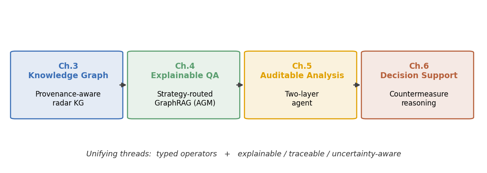

# 第一章 绪论

## 1.1 研究背景与意义

现代战争已进入信息化、智能化的电磁博弈时代。雷达作为战场感知的核心传感器，其型号、体制、参数与部署随技术发展和实战演化而不断扩充，形成了规模庞大、来源异构、更新频繁的**雷达情报**。情报人员既需要快速检索与比对装备知识（"某型雷达的工作频段、研制方、部署平台是什么"），更需要在此基础上进行综合分析与对抗决策（"面对敌方某防空体系，我方应采用何种干扰手段、规避何种风险"）。传统上，这类知识以手册、图册和专家经验的形式分散存在，检索效率低、难以关联推理，更难以支撑实时决策。如何对雷达情报进行结构化组织、可靠问答与决策辅助，是军事智能化的一项基础性课题。

知识图谱（Knowledge Graph, KG）以"实体—关系—实体"的结构化形式组织知识，天然适合表达雷达装备及其研制方、平台、体制、功能之间的复杂关联[1,2]。与此同时，大语言模型（Large Language Model, LLM）展现出强大的语言理解与生成能力，将其与外部知识相结合的检索增强生成（Retrieval-Augmented Generation, RAG）[4]，以及进一步利用图结构的图检索增强生成（GraphRAG）[5,11]，已成为知识密集型问答的主流范式。

然而，将通用方法直接应用于雷达情报领域并进一步推向对抗决策，存在本质性的不匹配。情报与决策领域具有三个区别于开放域问答的刚性特征：**专业性**（知识高度领域化、术语密集）、**可解释性**（每条结论必须可溯源、可审计，否则不可用于决策）、以及**面向决策**（最终目的不是"回答事实"，而是"给出建议"，且建议伴随不可忽视的不确定性与代价）。这些特征决定了：单纯追求答案正确率的通用问答方法，并不足以服务于雷达情报分析与对抗决策。

因此，研究面向雷达情报领域的、可解释且可支撑决策的知识图谱问答与分析方法，既有重要的应用价值，也对"如何在高代价、知识稀疏的专业领域中可靠地使用大语言模型"这一普遍问题具有方法论意义。

## 1.2 国内外研究现状

### 1.2.1 知识图谱与领域知识图谱构建

知识图谱自提出以来已广泛应用于搜索、问答与推理[1]。Hogan 等人对知识图谱的数据模型、查询语言、构建与精化进行了系统综述[1]；Ji 等人则从表示、获取与应用角度梳理了知识图谱的研究脉络[2]。在构建层面，研究重点包括从非结构化文本中抽取实体与关系、模式（Schema）设计与本体对齐、以及多源知识融合。近年来，利用大语言模型辅助知识抽取与图谱构建成为新趋势，但在专业领域中，抽取结果的**准确性与可溯源性**仍是关键瓶颈：错误或无据的事实一旦进入图谱，将沿推理链放大。面向军事/装备等专业领域的知识图谱构建工作相对较少，且普遍缺乏对来源与置信度的显式建模，难以满足情报应用对可信度的要求。

### 1.2.2 知识图谱问答与图检索增强生成

知识图谱问答（KGQA）旨在用结构化知识回答自然语言问题，传统方法可分为语义解析（将问题翻译为形式化查询如 SPARQL）与信息检索（检索子图后排序作答）两类[10]。RAG[4] 通过引入外部非参数化记忆缓解大模型的幻觉与知识陈旧问题；Dense Passage Retrieval[18] 等稠密检索进一步提升召回质量。GraphRAG[5] 在 RAG 基础上引入图结构与社区摘要，提升了面向全局性问题的能力，相关综述见文献[11]。

在 LLM 与 KG 结合的推理方向上，代表性工作包括：RoG[6] 提出"规划—检索—推理"框架，先由模型生成关系路径作为可信计划，再据此检索推理路径，强调忠实性与可解释性；ToG[7] 将大模型作为智能体在图谱上迭代式束搜索，发现高置信推理路径。Pan 等人则系统论述了统一大模型与知识图谱的路线图[3]。这些工作显著提升了开放域多跳推理的效果，但它们大多面向通用百科型图谱，**默认一种统一的检索/推理范式**，对"不同问题需要不同图结构"这一现象缺乏针对性处理；在专业领域中，这种"一刀切"的检索往往与问题真正所需的图结构错配，导致召回冗余或缺失。本文第四章提出的"答案-几何失配"诊断正是针对这一空白。

### 1.2.3 大语言模型推理与智能体

思维链（Chain-of-Thought, CoT）提示[9] 通过显式生成中间推理步骤显著提升大模型的复杂推理能力。ReAct[8] 进一步将推理（Reasoning）与行动（Acting）交错，使模型能够调用外部工具、获取信息并动态调整计划，奠定了大模型智能体（Agent）的基本范式。基于此，"模型即智能体、工具即能力"的架构被广泛用于构建多步任务求解系统。然而，将大模型直接置于决策链路中也带来风险：其生成具有随机性与幻觉[29]，关键事实若由模型自由生成，则结论不可复现、不可审计。如何在利用大模型语言能力的同时，**将其移出关键事实的"信任路径"**，是面向高可靠性应用的核心设计问题，目前仍缺乏系统性的方法论，本文第五章对此给出可证明的架构方案。

### 1.2.4 雷达对抗决策的知识化与智能化

电子战对抗决策长期依赖专家经验与威胁库/任务数据文件（Mission Data File）。其学理（doctrine）在经典著作中已有系统总结：Adamy 的《EW 101/102/103》系列[13,14]、Schleher 的《信息时代的电子战》[15] 系统阐述了压制干扰、欺骗干扰与抗干扰（ECCM）的原理与对抗关系；雷达原理则可参考 Skolnik 的经典手册[16]。在智能化方向上，近年研究主要集中于**认知电子战**：将干扰决策建模为马尔可夫决策过程，采用 Q-学习、深度 Q 网络乃至多智能体深度强化学习进行干扰样式的自适应选择，相关进展见综述[12]。这类方法在特定对抗回合中表现出自学习能力，但普遍是**面向具体干扰参数的黑箱优化**：缺乏对学理知识的显式表示，决策依据不可解释、不可溯源，且高度依赖可交互的对抗环境与奖励信号，难以直接用于"基于已知威胁布控、给出可解释对抗建议"的情报辅助场景。将电子战学理形式化为知识图谱推理、并以可解释、可审计的方式给出对抗建议的工作，目前尚不多见。

## 1.3 存在的问题与挑战

综合上述现状，面向雷达情报的可解释问答与对抗决策仍存在如下挑战：

- **C1 检索与问题形态的结构性错配。** 通用 GraphRAG 采用统一检索范式，未能识别不同问题所需的图结构（单点查询、邻域枚举、补集、路径、约束求交等），导致召回与问题"几何形状"不匹配，在专业领域尤为突出。
- **C2 生成式模型不满足可审计要求。** 情报与决策要求每条结论可溯源、关键数字不可编造，而大模型的随机生成难以保证；需要在架构层面隔离"事实生成"与"语言表达"。
- **C3 领域知识稀疏、异构且涉密。** 雷达对抗的逐型号实战弱点多为机密，开放可得的是学理级一般规律与少量已解密战史；威胁参数来源众多、可信度不一，须显式建模来源与不确定性。
- **C4 从问答到决策缺乏可解释的推理机制。** 现有智能化对抗多为强化学习黑箱，难以将学理知识形式化为可解释、可溯源、且具理论保证的决策推理。

## 1.4 本文主要研究内容与创新点

围绕上述挑战，本文以雷达情报领域为背景，构建"构建知识图谱 → 可解释问答 → 可审计分析 → 对抗决策支持"的递进式技术路线，主要研究内容与创新点如下：

1. **雷达领域可溯源知识图谱构建（对应 C3，第三章）。** 设计面向雷达装备的属性图模式，多源抽取并为每条事实附加来源/置信度/证据，形成可溯源的领域知识底座。

2. **策略路由的 GraphRAG 与答案-几何失配诊断（对应 C1，第四章）。** 形式化"答案-几何失配"现象，提出 O(1) 分发器与六类类型化检索算子，使检索结构与问题几何匹配；在自建基准 RadarKG-QA-499 上总体准确率 88.6%，较 Top-K 基线提升 35.9 个百分点、较 RoG 提升 28.3 个百分点。

3. **双层可审计分析智能体（对应 C2，第五章）。** 提出"内层算子组合执行器 + 外层 ReAct"双层架构与"大模型不进入信任路径"原则；组合评测 99%，报告引证覆盖与概述可溯源率均为 100%。

4. **面向雷达对抗的可解释决策支持（对应 C3、C4，第六章）。** 将电子战学理形式化为知识图谱推理，给出三分输出的确定性可审计推理算子（证明其可审计性），将战场级方案归约为加权集合覆盖并给出 $H_n$ 近似算法；构建覆盖九国、三十余体系、八十余部威胁雷达的可溯源威胁库，并以战史独立检验。

上述工作贯穿"**类型化算子**"（检索算子 → 组合算子 → 对抗推理算子）与"**可解释、可溯源、不确定性显式建模**"两条主线。总体技术路线如图 1-1 所示。

**图 1-1　本文总体技术路线：构建知识图谱 → 可解释问答 → 可审计分析 → 对抗决策支持**

## 1.5 论文组织结构

本文共七章，组织如下：

- **第一章 绪论。** 阐述研究背景与意义，综述国内外研究现状，凝练问题与挑战，概述本文工作与创新点。
- **第二章 相关理论与技术基础。** 介绍知识图谱、检索增强生成与 GraphRAG、大模型推理与智能体范式，以及雷达情报与电子战的基础概念。
- **第三章 雷达领域可溯源知识图谱构建。** 给出属性图模式、多源抽取流程与可溯源元数据设计，及知识图谱质量评估。
- **第四章 策略路由的 GraphRAG 与答案-几何失配。** 提出 AGM 诊断、分发器与六类检索算子，并给出问答实验与消融分析。
- **第五章 面向雷达情报的双层可审计分析智能体。** 给出算子组合执行器、ReAct 编排、可溯源报告与反思机制，及相应评测。
- **第六章 面向雷达对抗的可解释决策支持。** 给出问题形式化、对抗本体与反制关系、确定性推理与可审计性、加权集合覆盖算法及战史校验。
- **第七章 总结与展望。** 总结全文工作与创新，讨论局限与未来方向。
