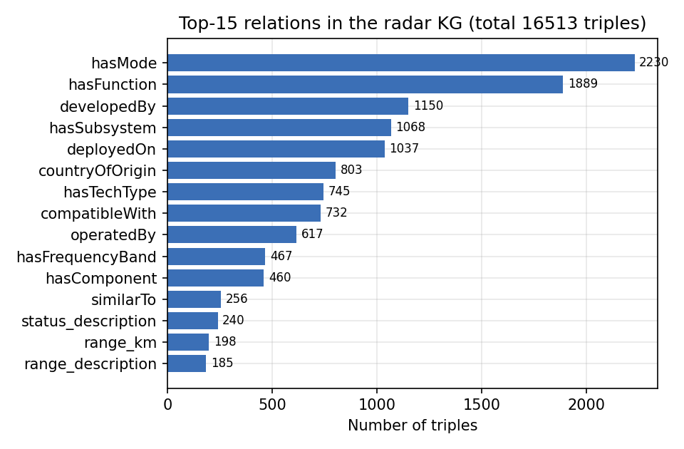
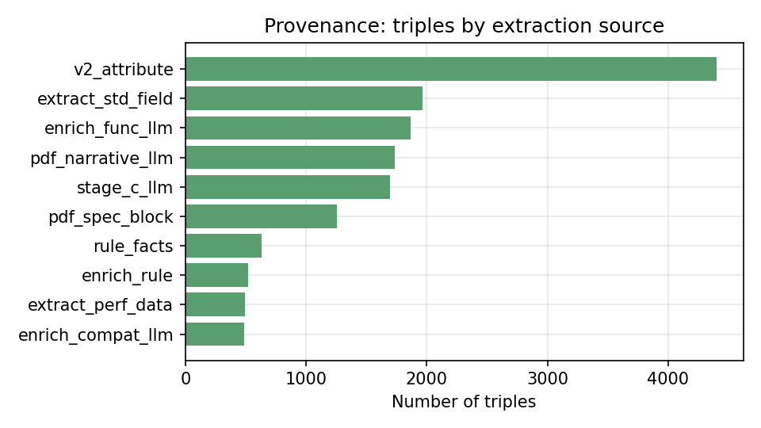

# 第三章 雷达领域可溯源知识图谱构建

知识图谱是后续问答（第四章）、分析（第五章）与对抗决策（第六章）的统一知识底座。本章针对雷达情报的领域特性，设计面向雷达装备的属性图模式（§3.2），给出多源知识抽取流程（§3.3）与可溯源元数据模型（§3.4），并对所构建图谱进行规模与质量评估（§3.5）。

## 3.1 概述与设计目标

雷达情报具有三个对知识表示提出特殊要求的特性：（i）**实体—关系与实体—属性并重**：既有"型号—研制方—国家""型号—部署平台"等关系，又有"频段、探测距离、峰值功率、服役年代"等大量数值/枚举属性；（ii）**来源异构、可信度不一**：知识来自领域手册、公开百科、结构化知识库与规则推断，质量参差；（iii）**面向可信应用**：图谱将服务于情报问答与对抗决策，任一错误事实都可能沿推理链放大，故每条知识必须**可溯源**。

据此，本章的设计目标为：

- **G1 表达充分**：以属性图区分"实体间的边"与"实体上的属性"，避免将属性强行表示为大量字面量尾节点而造成的边稀疏（§3.2）。
- **G2 多源可融合**：建立从非结构化手册、半结构化百科到结构化知识库的统一抽取与归一流程（§3.3）。
- **G3 可溯源**：为每条声明附加来源、置信度与证据三元组，使任意查询结果可回溯（§3.4）。

## 3.2 雷达装备属性图模式

### 3.2.1 形式化定义

沿用第二章的属性图定义，本文将雷达知识图谱建模为

$$G=(V,\,E,\,A,\,\ell,\,\mathrm{prov}),$$

其中 $V$ 为实体节点集，$E\subseteq V\times\mathcal{R}\times V$ 为带类型 $\mathcal{R}$ 的有向边集，$A:V\times \mathcal{K}\rightharpoonup \mathcal{U}$ 为节点属性赋值（$\mathcal{K}$ 为属性键集、$\mathcal{U}$ 为取值域），$\ell:V\to \mathcal{T}$ 为实体类型标注（$\mathcal{T}$ 为类型集），$\mathrm{prov}$ 为可溯源元数据函数（§3.4）。这一定义相对传统 RDF 三元组模型的关键区别在于：**属性 $A$ 与边 $E$ 分离**——把"频率、功率、年代"等内禀特征作为节点属性，而非退化为大量 `hasXxx` 字面量边。

### 3.2.2 实体类型与关系

图谱的核心实体类型 $\mathcal{T}$ 包括：雷达系统（Radar）、子系统/部件（Subsystem/Component）、研制方（Manufacturer）、国家（Country）、平台（Platform，含舰载/机载/地面）、频段（FrequencyBand）、技术体制（TechType）、工作模式（RadarMode）、功能（Function）、武器（Weapon）、标准（Standard）等。关系 $\mathcal{R}$ 区分为"实体间的边"（如 `developedBy`、`operatedBy`、`countryOfOrigin`、`deployedOn`、`upgradeOf`、`compatibleWith`、`hasFrequencyBand`、`hasTechType`、`hasMode`、`hasFunction`、`hasSubsystem`、`meetsStandard` 等）与"应作为属性"的数值字段（如 `range_km`、`frequency_GHz`、`peak_power_kW`、`weight_kg`、`year` 等）。表 3-1 列出代表性关系及其域—范围约束。

**表 3-1 代表性关系及其域—范围约束（节选）**

| 关系 | 域 → 范围 | 语义 |
|---|---|---|
| `developedBy` | Radar → Manufacturer | 研制方 |
| `countryOfOrigin` | Radar → Country | 原产国 |
| `operatedBy` | Radar → Country | 使用国 |
| `deployedOn` | Radar → Platform | 部署平台 |
| `hasFrequencyBand` | Radar → FrequencyBand | 工作频段（可多值） |
| `hasTechType` | Radar → TechType | 技术体制（如 AESA/脉冲多普勒） |
| `hasMode` / `hasFunction` | Radar → RadarMode/Function | 工作模式/功能（可多值） |
| `upgradeOf` / `derivedFrom` | Radar → Radar | 型号演化关系 |
| `compatibleWith` | Radar → Weapon | 武器兼容 |

> 设计权衡：将"主要研制方/原产国"等单值字段同时以边与属性冗余存储——边用于反向查询与多跳推理（"某厂研制了哪些雷达"），属性用于高效的单跳读取（"某雷达原产国"）。

## 3.3 多源知识抽取流程

图谱构建采用"抽取—归一—融合"的分阶段流程，如图 3-1 所示。

```
                          图 3-1  多源知识抽取与融合流程
┌──────────────┐   ┌──────────────┐   ┌──────────────┐   ┌──────────────┐
│  领域手册PDF  │   │  公开百科文本 │   │  结构化知识库 │   │   规则/推断   │
│ (机载雷达手册)│   │  (Wikipedia)  │   │  (Wikidata)   │   │              │
└──────┬───────┘   └──────┬───────┘   └──────┬───────┘   └──────┬───────┘
       │ OCR+版面解析       │ 段落/信息框      │ SPARQL/对齐      │ 既有图谱派生
       ▼                   ▼                  ▼                  ▼
┌─────────────────────────────────────────────────────────────────────┐
│        大模型辅助抽取（模式受限 + 关系/属性约束 + 证据要求）           │
└───────────────────────────────┬─────────────────────────────────────┘
                                 ▼
        ┌───────────────  归一化层  ───────────────┐
        │  实体别名消解(双语)·频段/国家规范·数值单位 │
        └───────────────────┬──────────────────────┘
                            ▼
        ┌──────────  融合 + 可溯源元数据(来源/置信/证据)  ──────────┐
        │              merged_triples（属性图实例）                  │
        └────────────────────────────────────────────────────────────┘
```

各阶段要点如下：

1. **手册抽取（pdf_spec_block / pdf_narrative_llm）。** 对领域手册做版面解析与 OCR，按"参数表块"与"叙述段落"分别抽取：前者以正则解析结构化字段，后者由大模型在模式约束下抽取关系与属性。
2. **百科与开放库（stage_c_llm / 联网补全）。** 对图谱未覆盖或字段缺失的型号，从公开百科获取文本并经大模型抽取，结果标注为联网来源、较低置信，与图谱主体显式区分。
3. **规则派生（enrich_rule / 结构推断）。** 对可由既有图谱确定性派生的关系（如同平台部署的"协同部署"），以规则生成并标注规则来源，**与真实抽取严格区分**，避免以推断充当实证。
4. **归一化。** 经双语别名层消解实体（中英文及别名映射到规范实体），规范频段（单字母 S/X/L…）、国家（中文标准名）与数值单位。
5. **融合与去噪。** 合并多源三元组，剔除 OCR 残片与自循环等噪声，输出带元数据的属性图实例 `merged_triples`。

> 抽取的**质量优先于数量**：本文在抽取链中明确拒绝"为提升边数而进行的规则灌注"，仅保留有据可溯的事实与显式标注的规则派生，这与情报应用对可信度的要求一致。

### 3.3.1 多智能体抽取与忠实度门控

图 3-1 中"大模型辅助抽取"环节若退化为单次提示调用，存在两点不足：一是抽取结果的忠实度缺乏显式校验，模型可能产出原文并不支持的声明；二是固定模式会丢弃模式外的重要事实。为此，本文将该环节细化为三个职责分离的智能体协作流水线：

- **抽取器（Extractor）**：在模式约束下从源文本抽取候选三元组，是产量主力。
- **校验器（Critic）——忠实度门控**：逐条判定"尾值是否在原文中出现、是否被讹误"，拒绝无原文支撑者。其判定范围**严格限定于 value-in-text**，不对关系类型的"合理性"做二次判断——后者会误毙合法领域事实（见下文消融）。该门控同时以轻量词面形式用于受控模式扩展的补抽（§3.5）。
- **模式提议器（Schema-Proposer）**：对现有关系无法承载的重要事实，提议候选新关系进入独立池，经人工审核后**受控**加入模式（而非自动注入类型核心），由此发现的关系缺口与落地结果见 §3.5。

**批判门控的消融（忠实度增益与其边界）。** 为厘清校验器的真实价值，本文在同一组文档上对照"是否经校验"与"输入是否含噪"（以 OCR 式降质模拟扫描手册），接地率一律对**干净原文**判定（真值）。结果如表 3-2。

**表 3-2　忠实度门控的消融（接地率对干净原文，按文档平均，n=30）**

| 输入 | 仅抽取器 | +校验器 | 增益 | 产量变化 |
|---|---:|---:|---:|---|
| 干净 | 83% | **88%** | **+5.1pp** | 376→320 |
| 含噪 | 81% | 85% | +3.4pp | 366→301 |

由表 3-2 可得三点诚实结论：（i）**忠实度门控确实提升接地率**（干净 +5.1pp、含噪 +3.4pp），代价是约 15% 的产量下降——即以召回换精度，这恰合可审计情报图谱"宁缺毋滥"的取向；（ii）**增益不随输入噪声上升**：词级噪声仅将抽取忠实度由 83% 降至 81%（模型可读穿错字），故门控的价值在于"忠实度—精度"而非"噪声恢复"；（iii）**校验范围决定成败**：当校验器越界去判断"关系类型是否合理"时，会误毙诸如"AMES Type 82 用于预警"这类正确事实，反而使接地率由 86% 降至 82%。据此本文采用**窄范围忠实度校验**，并将"模式合理性"交由提议器与人工审核处理，而非让校验器越权。

> 该多智能体分解的意义不在于堆叠模块，而在于**把"可信度"做成抽取流程内的一等机制**：校验器是 §3.4 可溯源模型中"证据—置信"得以成立的执行者，提议器则在不破坏类型约束的前提下持续扩展模式覆盖。

## 3.4 可溯源元数据模型

为满足 G3，本文为每条声明 $x$（边或属性）附加可溯源三元组

$$\mathrm{prov}(x)=\big(\mathrm{source}(x),\ \mathrm{conf}(x)\in[0,1],\ \mathrm{evidence}(x)\big),$$

其中 $\mathrm{source}$ 标识抽取来源（如 `pdf_spec_block`、`stage_c_llm`、`enrich_rule`、`wikipedia`），$\mathrm{conf}$ 为来源相关的置信度，$\mathrm{evidence}$ 为支撑该声明的原文片段或派生依据。该元数据贯穿后续各章：第五章据此生成逐条带来源与置信的情报报告，并对低置信事实显式标注；第六章据此实现来源分层的不确定性传播。

> **可溯源性的意义。** 在情报与决策场景中，"一个结论"远不如"一个可核验其来源与可信度的结论"有用。$\mathrm{prov}$ 使图谱从"知识的集合"升级为"可审计的知识"，这是本文区别于一般领域图谱的关键设计。

## 3.5 图谱规模与质量评估

最终构建的雷达知识图谱包含 **17 096** 条三元组（其中含 §3.3.1 模式提议器经受控扩展、忠实度门控补抽的 583 条新边，见下文）。图 3-2 给出三元组数量最多的 15 类关系：工作模式（`hasMode`）、功能（`hasFunction`）、研制方（`developedBy`）、子系统（`hasSubsystem`）、部署平台（`deployedOn`）等关系占据主体，反映了雷达装备"多模式、多功能、多部署"的领域特征；同时可见经属性化处理后，数值字段（如 `range_km`）以适度规模并存，验证了 §3.2 属性图设计避免边稀疏的有效性。



**图 3-2　雷达知识图谱中数量最多的 15 类关系**

图 3-3 给出按抽取来源统计的三元组分布：属性化字段（`v2_attribute`）、结构化字段抽取（`extract_std_field`）、功能富化（`enrich_func_llm`）、手册叙述与参数块抽取（`pdf_narrative_llm`、`pdf_spec_block`）等构成主要来源。来源的多样性与可标注性，是 §3.4 可溯源模型得以落地的前提。



**图 3-3　三元组按抽取来源的分布（Top-10）**

在质量层面，本文沿可信知识图谱评估的标准维度（Zaveri 等的质量框架[33]）给出**可量化且诚实**的评估。需先厘清一个常被混淆的前提：**质量 ≠ 准确率**——准确率（事实对错）是唯一须以人工/独立金标判定的维度，而一致性、忠实度、印证度、覆盖度等均可由**无需金标的自动指标**度量。本文据此组织评估：**自动忠实度/一致性指标 + 独立交叉核验 + 任务式外在评估**，并辅以**领域专家分层抽样的人工金标准确率**（表 3-3，详见下文 (iv)）。尤其地，**忠实度（faithfulness，抽取是否忠于原文）与准确率（accuracy，事实是否为真）是两回事**：前者抓"模型有没有瞎编"，后者抓"原文/链接对不对"，本文区分报告。

**表 3-3　知识图谱质量评估（多维度）**

| 维度 | 方法 | 结果 | 需人工金标 |
|---|---|---|:--:|
| 可溯源性 | 元数据覆盖率 | **100%**（每条带来源/置信/证据） | 否 |
| 一致性 | 类型签名违例 | **0.07%**（12 条；原始 6.49% 几为命名问题） | 否 |
| 一致性 | 功能性冲突 / 噪声残片 | **222** 个头 / **3.2%** | 否 |
| 忠实度（字面） | 引文级字符串接地 | **81%**（叙述 88%／参数块 77%）；门控补抽 **97%** | 否 |
| 忠实度（语义） | **NLI 蕴含判定**（样本 n=178） | 支持 **57%**；较字符串 **+24 找回／−37 揪出** | 否 |
| **准确率（人工金标）** | 领域专家分层抽样（n=173，Gao'19[34]） | **85.1%** 分层 95%CI[75,95]／91% 合并 | **是** |
| 多源印证 | 独立来源投票 | 仅 **0.3%** 被 ≥2 源印证（来源互补非冗余） | 否 |
| 独立交叉核验 | Wikidata 比对 | 覆盖稀疏；**查出真实错误**（AN/APG-81/77 误标研制方） | 半（外部库） |
| 任务式（外在） | RadarKG-QA-499（第四章） | **88.6%** 可解释问答 | 外在指标 |
| 覆盖度 | 受控模式扩展（§3.3.1） | **+583 边**，190 型号获新边 | 否 |

**几点方法学说明与诚实结论：**

（i）**忠实度用语义而非字面度量。** 朴素字符串接地有两类错：把改写/翻译的正确事实误判为未接地（漏判），又把"字面出现但并不表达该关系"的错误事实误判为接地（误判）。本文以 NLI 蕴含判定（给裁判**原文**、只判是否支持，从而判读理解而非世界知识，缓解"以大模型评大模型图谱"的循环）取而代之：样本上它找回 24 条字符串漏判、揪出 37 条字符串误判，且**揪出多于找回**，说明**字符串接地高估了忠实度**；NLI 支持率 57% 是更硬的下界（引文片段常较短，含欠完整引文与少量裁判误判）。该指标对**本文自身新增的模式扩展边同样有效**（揪出了一条可疑的 `replaces` 边），体现评估的中立性。

（ii）**多源投票在本图谱不适用，反证置信分层的合理性。** 四个独立来源（百科/手册/Wikidata/GlobalSecurity）仅 0.3% 的事实被 ≥2 源同时印证——它们**互补（覆盖不同型号）而非冗余**，故 Knowledge-Vault[35] 式跨源投票在此失效；这正说明 §3.4 的**逐源置信分层**比依赖跨源印证更契合本场景。

（iii）**以任务表现外在佐证图谱质量。** 第四章在 RadarKG-QA-499 上取得 88.6% 的可解释问答准确率——图谱需足够准确、可溯源，方能支撑此结果，这是对图谱可用质量的外在证据。

（iv）**准确率：领域专家分层抽样的人工金标。** 本文摒弃"以大模型判大模型图谱"的循环式自评（弃用现成的 LLM 自动标注），改由领域专家按 Gao 等（VLDB'19）[34]的分层抽样对 **173 条**三元组逐条人工核对（每条附可核证据，核实率 99%）。结果：**按各来源在全库占比加权的图谱准确率为 85.1%（95% CI [75.1%, 95.0%]）**，合并 Wilson 估计 90.7%（[85.4%, 94.2%]）。二者之差恰揭示真相——**最大的来源层（数值属性，占库约三成）也是最弱层（精度 64%）**，加权估计如实反映了这一点。**per-source 精度进而验证了 §3.4 的置信分层**：文本/结构化来源精度高（`stage_c`、参数块、Wikidata、受控扩展均 92–100%，其中 §3.3.1 新增边人工核验 **100%**），数值/性能属性最弱（`v2_attribute` 64%、`extract_perf_data` 75%）——"数值属性置信应下调"由此从推测升级为**人工金标证实**的结论。**尤须强调:单一 85% 会掩盖层间差异,故本文按来源层分解报告(表 3-4)。抽取层普遍达 90–93%,而属性摊平层仅 69%;更关键的是,规则/推断富化层（占库约 25%）按设计为低置信、本次未纳入金标标注——因此 85% 是对可核验抽取部分（约占库 75%）的加权准确率,`下游若不按 §3.4 置信分层过滤推断层,实际可用准确率将低于此值`,这是须诚实声明的使用边界。**

**表 3-4　按来源层的人工金标准确率（诚实分层，避免单一数字掩盖层间差异）**

| 来源层 | 占库 | 人工精度 |
|---|---:|---:|
| 手册（PDF/OCR 抽取） | 42% | **93%** |
| Wikidata | 2% | 92% |
| 公开百科 LLM | 2% | 90% |
| 受控 schema 扩展 | 3% | 100% |
| 属性摊平（数值/描述） | 25% | **69%** |
| 规则/推断富化 | 25% | **未测（低置信，应过滤）** |

（v）**错误类型学与自动指标的相互印证。** 对 16 条判错的归纳暴露出几类系统性错误，且与前述自动指标高度一致：①**张冠李戴**（APQ-120 的平台被误挂到 APQ-36/AWG-11）——正是 (i) 中 NLI 揪出的同型错误；②**收购方 ≠ 原研制方**（Northrop Grumman 记成原研 Westinghouse/Bendix）——正是独立 Wikidata 交叉核验发现的同型错误；③**关系混淆**（"吸取…经验"记为 `衍生自`、"developed *for* …"记为研制方、机体承包商记为雷达研制方）；④**数值属性拼接/错值**；⑤**劣质头实体**（"ATR,"、地名 "Chelmsford" 被当作雷达型号）。**人工与自动评估在错误类型上的一致，构成相互印证**，并把改进重点明确指向数值属性与实体消解——后者经实测（确定性规范化在本图谱上弊大于利，原始计数本就接近金标、激进合并反误并不同型号）列为未来工作，而非以未经验证的方法粉饰指标。

（vi）**面向最弱层的数据清洗（方法与诚实边界）。** 承 (iv) 的诊断（数值属性层最弱，64%，且错误集中于 `*_description` 的 OCR 乱码片段），本文对该层实施分层清洗：**确定性层**安全删除 **187** 条"乱码描述 + 已有干净归一数值"的冗余错误副本（零信息损失，规范数值仍在）、修正若干劣质头与浮点，并将 **329** 条无干净副本的乱码片段**降置信**（而非删除或臆造，交由 §3.4 的置信过滤处理），图谱由 17 096 精简为 **16 909** 条，该层样本精度由 64% 升至 70%。进而尝试**大模型接地重抽**以修复乱码值，但经验证**几近不可行**：330 条乱码中仅 30 条的实体有语料源，最终仅 1 条通过接地门控——因这些乱码是手册细参数（脉宽、PRF、接收机、方位等），其清洁源（原始手册）不在语料中。**由此得到一个诚实边界：OCR 乱码的手册参数在缺原始手册时无法自动修复，正确处置是"删冗余 + 降权不可验证"，而非以模型臆造充数**——这与本文可信优先、如实区分有效与无效改进的取向一致。

这种"**区分忠实度与准确率、只报站得住的自动指标、诚实标注金标缺口、如实区分有效与无效改进**"的取向，与本文一以贯之的可信优先原则一致。

## 3.6 本章小结

本章面向雷达情报的领域特性，设计了实体—关系与实体—属性分离的属性图模式，给出了融合领域手册、公开百科、结构化知识库与规则派生的多源抽取流程，并提出为每条声明附加来源/置信度/证据的可溯源元数据模型。所构建图谱含 1.7 万余条三元组、来源多样且全部可溯源，并经多维度质量评估（一致性、忠实度、准确率）与受控模式扩展，为第四章的策略路由问答、第五章的可审计分析与第六章的对抗决策提供了统一、可信的知识底座。
