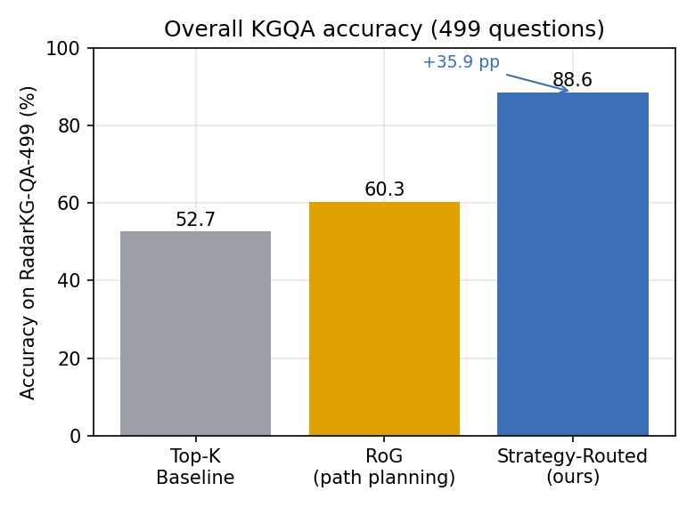
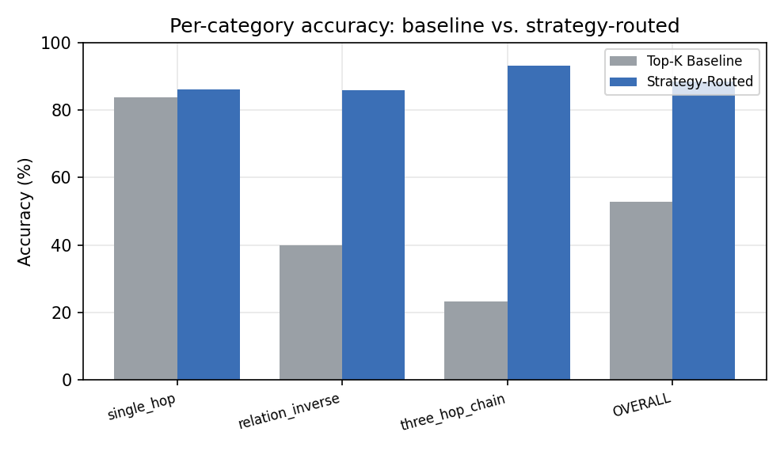
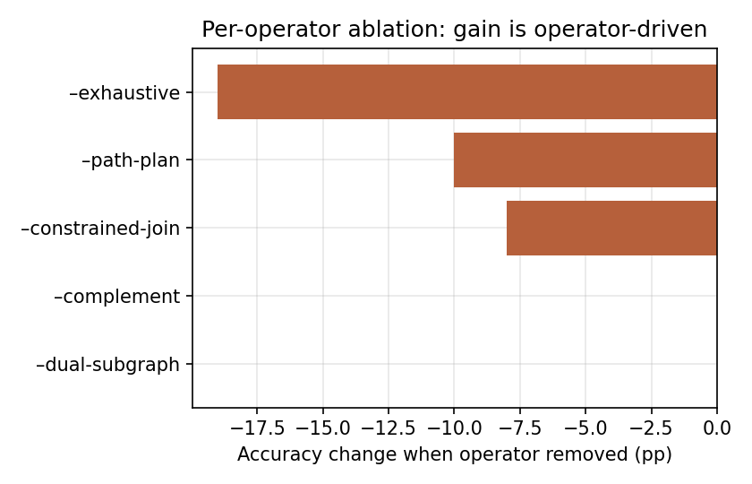

# 第四章 策略路由的 GraphRAG 与答案-几何失配

本章针对通用 GraphRAG 在专业领域问答中"检索结构与问题需求错配"的问题（第一章挑战 C1），提出并形式化**答案-几何失配**（Answer-Geometry Mismatch, AGM）现象（§4.2），据此设计由问题分发器与六类**类型化检索算子**构成的策略路由问答方法（§4.3、§4.4），并在自建领域基准上给出实验与消融分析（§4.5、§4.6）。

## 4.1 概述：Top-K 检索的隐含假设

主流 RAG/GraphRAG 的检索核心是 **Top-K**：以查询为锚，按表面相关度对候选（文本片段或子图）排序并取前 $K$ 个。这一机制隐含了一个关于**答案几何**的假设：

> **假设（Top-K 答案几何）。** 问题的答案是一个**小的、可由与查询的表面相关度排序得到的集合**。

该假设在事实型问答（如"某雷达的研制方是谁"）上成立，这也是 WebQSP、NaturalQuestions 等公开基准的主体形态。但在工业级、专业领域知识图谱上，大量问题的信息需求与该假设结构性地不相容。本章的出发点即是：**症结不在排序器的优劣，而在"用错了几何"**——修复之道不是更好的 Top-K，而是为每类信息需求配备恰当的算子。

## 4.2 答案-几何失配（AGM）诊断

### 4.2.1 现象与定义

借用数据库领域 OLTP/OLAP 的二分：Top-K 检索本质是一种 **OLTP 式点查**（定位少数最相关记录），而许多情报问题本质是 **OLAP 式聚合/集合运算**（计数、求交、求补、多跳合成、双侧对比）。当问题的信息需求属于后者时，再精的排序也无法以"取前 $K$"的几何把答案表达出来。

> **定义 4.1（答案-几何失配，AGM）。** 设问题 $q$ 的最小信息需求为满足其答案所必需的知识子集 $I(q)$。若不存在常数 $K$ 使得"按表面相关度排序的前 $K$ 个候选"能覆盖 $I(q)$，则称 $q$ 相对 Top-K 发生**答案-几何失配**。

### 4.2.2 Top-K 无法满足的信息需求类

我们不依赖对失败样例的经验归纳，而是**枚举 Top-K 无法满足的信息需求类**，并为每类推导一个原语算子（§4.3）。表 4-1 给出这一推导。

**表 4-1　信息需求类、Top-K 失败原因与对应算子**

| 信息需求类 | 答案所需 | Top-K 为何失败 | 对应算子 |
|---|---|---|---|
| 身份/事实型 | 一条最匹配三元组 | （Top-K 即可满足） | **lookup** |
| 无界枚举/计数 | 某关系的**完整**头/尾集 | $K$ 是上界，答案集可大于 $K$ | **exhaustive** |
| 多约束求交 | $N$ 个关系头集的交 | 排序无法表达 AND，混淆信号 | **constrained-join** |
| 补集/非成员 | 完整已知集 + 显式缺口 | 图谱只存正事实，缺失是非局部的 | **complement** |
| 关系合成（$k\ge2$） | 保持跳跃结构的**路径** | Top-K 是扁平的，丢失跳边界 | **path-plan** |
| 二元（集合级）对比 | **两侧**子图均显式且对齐 | Top-K 可能饿死一侧、无法对齐 | **dual-subgraph** |

> **AGM 是基准分布的性质，而非 Top-K 本身的性质。** 公开基准系统性地**少采样**这些类（其分布以事实型为主），故 Top-K 在公开基准上"看似够用"；而工业/专业图谱系统性地**多采样**这些类（计数、枚举、约束筛选是情报常态），故 Top-K 在此系统性失效。这一观察解释了"通用方法在专业领域水土不服"的结构性根因，并可迁移到雷达之外的领域。

## 4.3 类型化检索算子套件

基于表 4-1 的推导，本文设计六类算子。除 `lookup` 对应 Top-K 本就能满足的事实型外，其余五类各自满足一类 Top-K 无法满足的信息需求。算子在 KG-only 的执行器中实现，**不经大模型**，从而保证答案集合的确定性与可复现性。

**表 4-2　六类算子的形式化与实现机制**

| 算子 | 形式化 | 实现机制 |
|---|---|---|
| `lookup` | 取最匹配三元组 | BM25[27] + 双编码器(Sentence-BERT[28]) + RRF 融合 + 2 跳图扩展；（head, relation）参数命中时绕行 KG 直查 |
| `exhaustive` | $\{h\mid (h,r,t)\in\mathrm{KG}\}$，无 $K$ 截断 | 完整头/尾集枚举；空结果时等价类回退 |
| `constrained-join` | $\bigcap_i \mathrm{heads}(r_i,t_i)$ | $N$ 约束头集求交；**等价类回退**（交集为空时并入语义等价关系，如 `countryOfOrigin`$\cup$`operatedBy`），缓解多源抽取的子图割裂 |
| `complement` | 枚举 $\{t\mid(h,r,t)\in\mathrm{KG}\}$ 后显式判缺 | 标记空/非成员，使模型显式输出"否"而非臆造 |
| `path-plan` | 链式 $\mathrm{tails}_{r_1}\!\circ\cdots\circ\mathrm{tails}_{r_k}$ | 关系链 BFS，支持反向遍历 $r^{-1}$，返回终点集与完整边轨迹 |
| `dual-subgraph` | 对 $(A,B)$ 并行 $\mathrm{tails}$ + 集合运算 | 并行展开两实体子图，预计算 $A\cap B,\ A\setminus B,\ B\setminus A$ 并对齐呈现 |

`lookup` 还充当分发器纠错的**安全回退**：被误路由的问题退化为标准混合检索，而非落入错误算子的空结果。

## 4.4 分发器与双语别名层

**问题分发器**为一个零样本大模型路由器（实现采用 DeepSeek 系列大模型[30]）：给定问题类型学定义与少量示例，将"问题 → 类型 → 算子"映射。其路由准确率为 **93.0%**。值得强调的是（§4.6 将以消融证明）：分发器的贡献近似为 0，**全部增益来自算子设计本身**——这与"问题在于几何而非排序"的论点一致。

**双语别名层**为一条五级级联（直接匹配 → 614 形态别名索引 → 频段归一 → 后缀剥离 → 等价类并合），处理工业中文图谱"英文模式、中文为主取值"的混合语言问题，是算子在真实领域数据上稳定执行的工程保障。

整体流程为"三段大模型 + 一段 KG 执行"：分发器（选算子）、解析器（抽实体与关系链）、回答器（将证据渲染为自然语言），而知识图谱**仅在执行器中被查询，从不经由大模型**。

## 4.5 领域基准 RadarKG-QA-499

为暴露 AGM，本文构建 **RadarKG-QA-499** 基准：基于 RadarKG-v2（评测时为 16 513 条核心三元组、98 关系与属性、4 827 实体；§3.3.1 受控模式扩展新增的 583 条边为评测后增补，查询核心关系不受其影响，故不计入本基准），覆盖单跳、关系反查、计数、枚举、多跳桥接/链、属性筛选、否定/不可答、集合对比、干扰项等 11 个类别共 499 题；其 Count 类问题的中位基数为公开基准的 **3.4 倍**，并设 26 题双语 OOD 压力子集。该基准在分布上**显式过采样** AGM 类问题，从而能区分"真正解决了结构性失配"与"在事实型分布上刷分"。

## 4.6 实验与分析

### 4.6.1 总体结果

在全部 499 题上，对比三种方法：Top-K 基线、RoG[6]（统一路径规划）与本文策略路由方法。结果如图 4-1 与表 4-3 所示。

**图 4-1　RadarKG-QA-499 上的总体准确率（Baseline / RoG / 策略路由）**

**表 4-3　总体与代表性类别准确率（%，方括号为配对自举 95% 置信区间）**

| 类别 | 题数 | 基线 | RoG | 策略路由 | Δ(vs 基线) |
|---|---|---|---|---|---|
| single_hop | 80 | 83.8 | 11.2 | **86.2** | +2.5 |
| relation_inverse | 50 | 40.0 | 74.0 | **86.0** | +46 |
| three_hop_chain | 30 | 23.3 | 50.0 | **93.3** | +70 |
| **总体** | **499** | **52.7** | **60.3** | **88.6** | **+35.9 [+32,+40]** |

各代表性类别上基线与策略路由的对比如图 4-3 所示：在答案集结构性大于 $K$ 的类别（关系反查、三跳链）上，基线准确率极低而策略路由接近满分；在事实型的 `single_hop` 上两者相当——这正是 AGM 论点的直观体现。

**图 4-3　代表性类别上的准确率对比（基线 vs 策略路由）**

策略路由在 11 个类别中的 9 个以严格为正的置信区间取胜；其相对 RoG 亦提升 **+28.3 pp**。一个关键对照是：**RoG 在 `single_hop` 上较基线下降 72.5 pp**——当问题本不需要路径时，统一的路径规划反而劣于不规划。这恰印证了本文论点：不存在普适的最优检索策略，**应按问题几何选择算子**。

### 4.6.2 增益来自算子还是分发器？

**Oracle 分发器消融。** 将大模型路由替换为"问题类型→算子"的金标准路由，端到端准确率为 **88.2%**，与大模型路由（88.6%）相差仅 0.4 pp。**分发器噪声的贡献近似为 0**，全部 +35.9 pp 增益由算子驱动。

**逐算子消融**（图 4-2）。强制各算子回退到 `lookup`，准确率下降分别为：去 `exhaustive` $-19$ pp、去 `path-plan` $-10$ pp、去 `constrained-join` $-8$ pp，而去 `complement`/`dual-subgraph` 在本基准分布上约 0 pp（`lookup`+大模型在该否定/对比分布上可优雅降级）。下降幅度与各算子所针对的 AGM 类一一对应（如去 `exhaustive` 使计数/枚举/关系反查各跌约 60 pp），验证了 §4.3 "算子↔失配类"的 1:1 推导。

**图 4-2　逐算子消融：移除算子后的准确率变化**

**检索预算消融。** 将基线的 $K{=}8$ 提升至 $K{=}20$ 仅使基线提升 +2.4 pp，策略路由相对 $K{=}20$ 基线仍领先 +33.5 pp。**增加检索预算无法修复"答案集结构性大于任何 $K$"的问题**——这证明 +35.9 pp 并非小 $K$ 造成的假象。

**套件规模消融。** 联合移除的下降近似线性叠加（如去 `exhaustive`+去 `path-plan` $\approx-29\,\mathrm{pp}=-19-10$），表明三个承重算子作用于**互不重叠**的问题切片；其中 {lookup, exhaustive, path-plan, constrained-join} 四算子子集在本基准上即可达到 94.0% 的准确率，而仅 `lookup` 的下界为 57.0%。

## 4.7 本章小结

本章提出并形式化了答案-几何失配（AGM）现象，借 OLTP/OLAP 框架揭示了通用 Top-K/GraphRAG 在专业领域系统性失效的结构性根因，并据"信息需求类"推导出六类类型化检索算子与一个轻量分发器。在显式暴露 AGM 的 RadarKG-QA-499 基准上，方法取得 88.6% 的总体准确率，较基线 +35.9 pp、较 RoG +28.3 pp；一系列消融将增益精确定位到算子设计（分发器贡献约 0 pp），并验证了"算子↔失配类"的一一对应。本章的"类型化算子"思想，将在第五章被进一步发展为可组合、可审计的分析算子。
