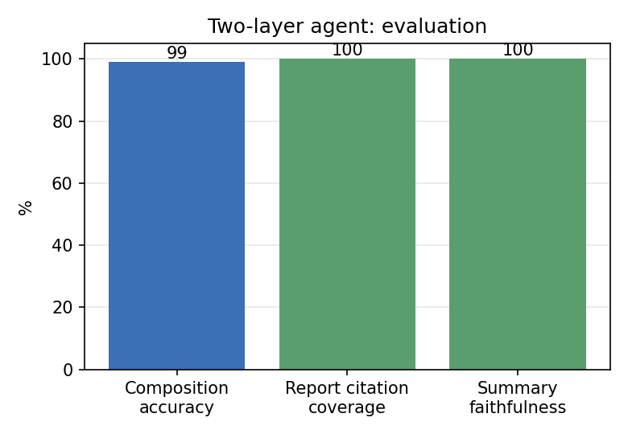

# 第五章 面向雷达情报的双层可审计分析智能体

第四章的策略路由解决了"单个问题用何种检索几何"的问题，但情报分析往往是**多步、组合、需产出可溯源情报产品**的任务（如"对比中美两型舰载雷达并生成档案"）。本章将单次问答升级为双层智能体（§5.2）：内层为类型化**算子组合执行器**（§5.3），外层为 ReAct 编排（§5.6）；并贯彻"大语言模型不进入信任路径"的可审计原则（§5.4），产出逐条可溯源的情报报告（§5.5）。最后给出评测（§5.7）。

## 5.1 概述：从问答到可审计分析

将第四章的问答能力推向分析，面临两个新要求：（i）**可组合**——复杂分析需把多个检索/集合运算组合成一个可确定性求值的整体，且中间实体不得在多次大模型转写中漂移；（ii）**可审计交付**——输出不应是一段可能含幻觉的叙述，而应是每条结论均挂"来源 + 置信度"的情报产品。为此本文提出双层架构，并把第四章的"类型化检索算子"发展为可嵌套组合的"分析算子"。

## 5.2 双层架构

系统分为内外两层，如图 5-1 所示。**外层**为手写的 ReAct[8] 编排循环：大模型每步输出一个 JSON 动作（调用某工具或结束），系统执行并回填观察，循环至给出最终回答。**内层**为类型化算子组合执行器：大模型仅产出一棵 JSON **计划树**，由确定性引擎递归求值，实体在树内传递、不经大模型二次转写。外层可调用的工具包括：组合查询（内层执行器）、可溯源装备档案、可溯源对比报告、图谱缺口联网补全。

```
                     图 5-1  双层可审计分析智能体架构
  用户分析请求 / 多轮对话
        │  (多轮指代消解：将含指代的追问改写为自包含问题)
        ▼
 ┌──────────────────────────  外层：ReAct 编排循环  ──────────────────────────┐
 │  大模型每步输出 JSON 动作  →  执行工具  →  观察  →  循环  →  final            │
 │  工具：① 组合查询  ② 装备档案  ③ 对比报告  ④ 联网补全                          │
 │  交付：确定性 artifact（报告全文 + 逐条证据）原样呈现，大模型仅写引导语        │
 └───────────────────────────────────┬──────────────────────────────────────┘
                                      │ 工具①
                                      ▼
 ┌──────────────  内层：类型化算子组合执行器 + 计划器  ──────────────┐
 │  大模型出 JSON 计划树  →  确定性递归求值（实体在树内传递）           │
 │  算子：constraint / intersect / union / difference / path /        │
 │        count / enumerate / aggregate / compare / contains          │
 │  权威答案由确定性 trace 生成；空/退化结果触发反思重规划             │
 └────────────────────────────────────────────────────────────────────┘
```

## 5.3 内层：类型化算子组合执行器

### 5.3.1 计划树文法

第四章的六类检索算子是"扁平"的（每问一算子）。为支持组合分析，本章定义可嵌套的**计划树**文法 $\mathcal{G}$（节点即算子，子节点为其操作数）：

$$
\begin{aligned}
\textit{Node} ::=\ & \mathtt{constraint}(r, v)\ \mid\ \mathtt{intersect}(N^{+})\ \mid\ \mathtt{union}(N^{+})\ \mid\ \mathtt{difference}(N, N)\\
\mid\ & \mathtt{path}(e, [r_1,\dots,r_k])\ \mid\ \mathtt{count}(N)\ \mid\ \mathtt{enumerate}(N)\\
\mid\ & \mathtt{aggregate}(f, a, N)\ \mid\ \mathtt{compare}(e_A, e_B, r)\ \mid\ \mathtt{contains}(N, e)
\end{aligned}
$$

其中 $\mathtt{constraint}(r,v)$ 返回满足 $(?, r, v)$ 的实体集，$\mathtt{intersect}/\mathtt{union}/\mathtt{difference}$ 为集合运算，$\mathtt{path}$ 沿关系链（支持反向 $r^{-1}$）遍历，$\mathtt{count}/\mathtt{enumerate}$ 为基数/枚举，$\mathtt{aggregate}(f,a,\cdot)$ 对集合内实体的数值属性 $a$ 做聚合 $f\in\{\text{avg,sum,max,min}\}$，$\mathtt{compare}$ 对两实体某关系求同异，$\mathtt{contains}$ 判成员。该文法把第四章的检索原语提升为**可组合的代数**：例如"中国研制的 S 波段雷达有多少种"对应

$$\mathtt{count}\big(\mathtt{intersect}(\mathtt{constraint}(\texttt{countryOfOrigin},\text{中国}),\ \mathtt{constraint}(\texttt{hasFrequencyBand},\text{S}))\big).$$

### 5.3.2 确定性递归求值

执行器对计划树做后序递归求值 $\mathrm{eval}:\textit{Node}\to (\textit{Value},\textit{Trace})$：叶子算子查询知识图谱，内部算子对子节点求值结果施加集合/数值运算，同时累积一棵**执行轨迹** $\textit{Trace}$（记录每步算子、输入、输出与命中的图谱事实）。关键性质是：**实体集合在树内以值传递**，不经大模型在中间步骤重新生成，从而杜绝了多步转写导致的"实体漂移"。

> **命题 5.1（组合求值的确定性）。** 给定知识图谱 $G$ 与计划树 $P\in\mathcal{G}$，$\mathrm{eval}(P)$ 的取值与轨迹是 $G$ 与 $P$ 的确定性函数，与任何大模型采样无关。
>
> *证明概要.* 叶子算子是对 $G$ 的确定性查询；内部算子为集合/数值的确定性运算；递归复合保持确定性。$\square$

## 5.4 可审计性：大模型不进入信任路径

设单次组合查询的输出为 $(\delta(P),\ \psi)$，其中**权威答案** $\delta(P)$ 由执行轨迹按确定性规则生成（如计数题输出"共 $n$ 款"、聚合题输出"$f(a)=x$（覆盖率 $c$）"），$\psi$ 为大模型对 $\delta(P)$ 的自然语言复述。

> **定理 5.2（分析答案的可审计性）。** 权威答案 $\delta(P)$ 是 $(G,P)$ 的确定性函数（命题 5.1）；大模型仅作用于 $\psi$，且 $\psi$ 被约束为对 $\delta(P)$ 的复述，不得增删数字与实体。故系统输出的**事实正确性不依赖大模型的事实性**，且可逐步回溯至图谱事实。

该定理的工程含义在一处典型故障中得到验证：早期实现让大模型直接读执行结果作答时，曾把"覆盖率 100 条"误述为"100%"；将 $\delta(P)$ 设为权威答案、大模型仅复述后，此类错误被根除。**把不确定的生成式组件移出关键事实的信任路径**，是本文在第五、六章一以贯之的架构原则。

## 5.5 可溯源情报报告

外层工具产出两类可溯源情报产品：**装备档案**（单型号）与**对比报告**（双型号）。其设计要点：

- **逐条引证**：报告中每条事实均由图谱确定性渲染，并附其来源与置信度，形如"研制方：×××〔来源:pdf_spec_block，置信:0.90〕"。
- **低置信过滤**：对置信度低于阈值（默认 0.75）的事实显式标注"⚠低置信"，且**不纳入**大模型自动概述，仅高置信事实参与概述生成；报告末尾汇总低置信条数，提示人工核验。
- **概述可溯源校验**：对大模型生成的概述做轻量校验——其中出现的实体/数值 token 必须能在被引证事实中找到来源，否则计为"未溯源"。该校验把"概述忠实性"变为可度量指标（§5.7）。

> 这与定理 5.2 一致：报告的事实层完全由图谱确定性生成，大模型仅在受约束、且仅可见高置信事实的条件下做语言组织。

## 5.6 外层编排、反思与多轮

**ReAct 编排**：外层以手写循环实现（JSON 动作，不依赖特定框架），便于对执行流程做完全控制与审计；最终回答阶段，系统将确定性 artifact（报告全文与逐条证据）**原样附加**，大模型仅写一句引导语，避免其在交付环节引入幻觉。

**反思重规划**：当内层执行返回空/退化结果时，系统并不直接作答，而是触发反思节点——以图谱中该关系的**真实取值**作为线索，提示计划器修正（如把约束值"在役"改为图谱实际存储的"服役中"），并重新求值。该机制以"图谱真实取值"为锚校正计划，1 轮即可修复多数取值不匹配类错误。

**多轮指代消解**：对含指代或省略的追问（"它的研制方呢？"），系统先依据对话历史将其改写为自包含问题（"AN/TPY-2 的研制方是谁？"）再进入执行，从而支持多轮分析对话。

## 5.7 评测

**组合能力。** 构造 72 题组合评测集（6 类各 12 题，金标准由执行器在图谱上算出），评测计划有效率、执行成功率与正确率。结果：计划有效率 100%、执行成功率 100%、**正确率 99%**（聚合/对比/差集/多重计数/多重枚举类 100%，两跳计数 92%）。这些均为单算子流水线无法表达的组合题。

**报告可审计性。** 在 30 份装备档案上评测：确定性事实的引证覆盖率为 **100%**（458/458 条均带来源）；大模型概述的可溯源率（token 级校验）均值为 **100%**（24/24 份零编造）。主要评测指标汇总于图 5-2。



**图 5-2　双层智能体的组合正确率、报告引证覆盖率与概述可溯源率**

**功能验证。** 反思节点在 1 轮内修复取值不匹配类的空结果，且不误触发正常查询；多轮指代消解正确改写追问；联网补全可在图谱未收录某型号时填补缺口并标注"未经图谱核验"。

## 5.8 本章小结

本章将单次问答升级为双层可审计分析智能体：内层以可嵌套的类型化算子组合执行器实现确定性组合求值（命题 5.1），外层以手写 ReAct 编排多步分析；并将"大模型不进入信任路径"形式化为可审计性定理（定理 5.2），据此产出逐条可溯源、低置信显式标注的情报报告。评测表明组合正确率 99%、报告引证覆盖与概述可溯源率均为 100%。本章的"可组合 + 可审计"思想，将在第六章被进一步用于构造面向对抗决策的推理算子。
