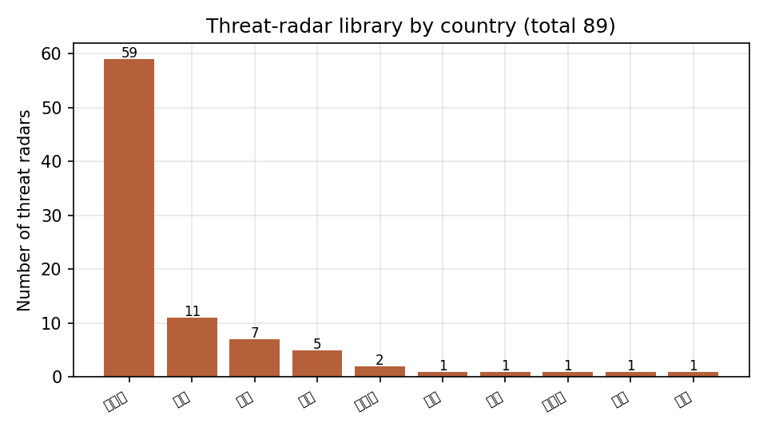
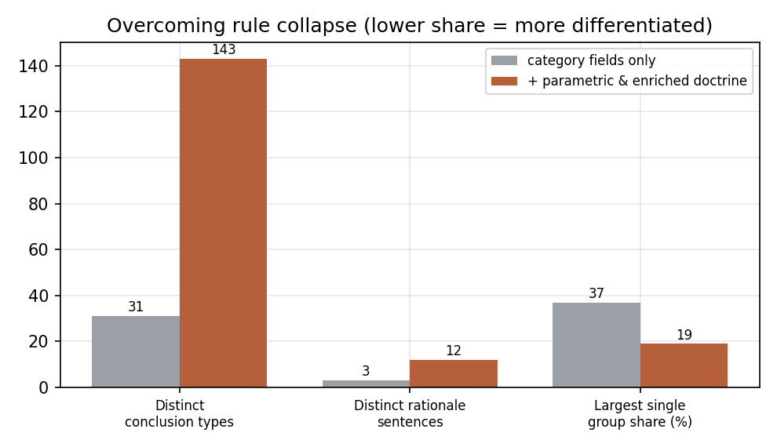

# 第六章 面向雷达对抗的可解释决策支持

> 本章将系统从"雷达情报问答"推进到"雷达对抗决策辅助"：给定敌方防空雷达布控，输出**应采用何种干扰手段、应避免何种手段、如何应对其抗干扰、并以何种最小装备集合覆盖整个威胁群**的建议。与第三、四章的检索式问答不同，本章面对的是一个**带不确定性、知识稀疏且高度异构**的决策问题。我们的核心立场是：在这种领域，系统的价值不在于"给出一个答案"，而在于**给出一个可解释、可溯源、其不确定性被显式建模的答案**。为此本章给出对抗决策问题的形式化、对抗知识的可信度分层表示、确定性可审计推理算子，以及将战场级方案归约为加权集合覆盖的近似算法。

---

## 6.1 引言与问题动机

### 6.1.1 从问答到决策的跃迁

第三、四章的图谱问答回答的是"是什么"(What)——某雷达的参数、某国研制了哪些雷达。而作战层面真正的需求是"怎么办"(What to do)：**面对敌方防空体系，我方该如何对抗**。这类问题具有三个本质区别：

1. **答案不是图谱中的一个节点，而是一个需要推导的方案**。它不存在于任何单一三元组中，必须由"威胁特征 + 对抗学理(doctrine)"合成。
2. **知识高度稀疏且涉密**。逐型号的实战对抗弱点多为机密；开源可得的是 doctrine 级(教科书级)的一般规律与少量已解密战史。
3. **不确定性是一等公民**。威胁画像本身可能是推断的、效能判断是启发式的——一个负责任的系统必须**显式携带并传播这些不确定性**，而非掩盖。

### 6.1.2 本章贡献

- **（1）形式化**：将雷达对抗决策形式化为知识图谱上的推导问题，给出对抗本体 (jamming/ECCM) 与 `defeats` 反制关系的代数刻画(§6.2、§6.5)。
- **（2）可信度分层**：提出三层来源的证据模型与置信度演算，使每条结论可回溯到"文献证据 / 学理推断 / 实战记载"三类来源之一(§6.3)。
- **（3）软健全性抽取**：以"引文校验"作为抽取的软健全性过滤器，并以一个良序的填空式合并保证多来源融合无冲突(§6.4)。
- **（4）可审计推理**：给出三分输出(可行/否决/被抵消)的确定性推理算子，并证明其**可审计性**——结论的事实部分仅由确定性 trace 决定，大语言模型不进入信任路径(§6.5)。
- **（5）算法**：将战场级对抗方案归约为加权集合覆盖，给出贪心算法及其 $H_n$ 近似保证，并据此定义"干扰样式经济性"与"能力缺口"分析(§6.6)。
- **（6）实证校验**：以已解密战史作为独立 ground truth 校验推理与学理的一致性，并量化"结论多样性"以验证系统克服了规则坍缩(§6.7、§6.8)。

---

## 6.2 问题形式化

### 6.2.1 威胁雷达与威胁画像

设威胁雷达集合为 $\mathcal{R}$。每部雷达 $r\in\mathcal{R}$ 由一个**威胁画像** (threat profile) 刻画，它是定义在属性集 $\mathcal{A}$ 上的部分函数

$$\pi(r):\ \mathcal{A}\ \rightharpoonup\ \bigcup_{a\in\mathcal{A}}\mathrm{dom}(a),$$

其中关键属性及其论域为：用途 $\mathsf{purpose}\in\{\text{search, acquisition, track, fire\_control, SAM\_guidance, GCI, AEW, early\_warning,}\dots\}$、跟踪体制 $\mathsf{track}\in\{\text{monopulse, conical\_scan, lobe\_switching, TWS, range\_gate, cw\_illuminator, none}\}$、扫描方式、频段 $\mathsf{band}$、频率 $\mathsf{freq}\in\mathbb{R}_{>0}$、峰值功率、捷变标志 $\mathsf{agile}\in\{0,1\}$、低截获标志 $\mathsf{lpi}$、以及已采用的抗干扰技术集合 $\mathsf{eccm}\subseteq E$。"部分函数"刻画了一个关键现实：**画像往往不完整**，某些属性对某些雷达是未知的。

### 6.2.2 对抗本体

定义两个本体集合：

- **干扰技术** $J$（jamming techniques），含压制类(瞄准/拦阻/扫频噪声)、欺骗类(距离门拖引 RGPO/RGPI、速度门拖引 VGPO、倒相增益、交叉眼、交叉极化、编队/闪烁、DRFM 假目标)与无源类(箔条、诱饵)；
- **抗干扰技术** $E$（ECCM），含频率捷变、PRF 抖动、单脉冲、旁瓣对消/匿影、脉冲压缩、前沿跟踪、干扰源寻的、极化分集等。

二者通过**反制关系** (counter relation) 联系：

$$\mathcal{D}\ \subseteq\ E\times J,\qquad (e,j)\in\mathcal{D}\iff \text{抗干扰技术 }e\text{ 能挫败干扰技术 }j .$$

例如 $(\text{单脉冲},\ \text{倒相增益})\in\mathcal{D}$、$(\text{前沿跟踪},\ \text{RGPO})\in\mathcal{D}$、$(\text{极化分集},\ \text{交叉极化})\in\mathcal{D}$。记 $\mathcal{D}(e)=\{j:(e,j)\in\mathcal{D}\}$ 为 $e$ 所克制的干扰集合。$\mathcal{D}$ 是一个非对称、非传递的二部关系——它正是对抗"猫鼠博弈"的代数骨架。

### 6.2.3 学理规则与决策问题

**学理知识**表示为带出处的规则集 $\mathcal{P}$。每条规则

$$\rho=\big(\mathrm{cond}_\rho,\ \mathrm{rec}_\rho,\ \mathrm{avoid}_\rho,\ c_\rho,\ \mathrm{src}_\rho\big),$$

其中 $\mathrm{cond}_\rho$ 是定义在画像上的合取谓词，$\mathrm{rec}_\rho\subseteq J$ 为推荐干扰集，$\mathrm{avoid}_\rho\subseteq J$ 为应避免集，$c_\rho\in[0,1]$ 为该条学理的置信度，$\mathrm{src}_\rho$ 为文献出处。

> **单威胁对抗决策问题。** 给定威胁 $r$ 与对抗本体 $(J,E,\mathcal{D},\mathcal{P})$，求一个三元划分 $\big(\mathrm{Viab}(r),\ \mathrm{Cnt}(r),\ \mathrm{Avoid}(r)\big)$ 及置信度赋值 $c(\cdot\,|\,r)$，使得每个判定都可回溯到 $\mathcal{P}$ 中的具体规则与 $r$ 的画像证据。

> **战场级对抗决策问题。** 给定威胁集合 $T\subseteq\mathcal{R}$ 及我方装备集 $\mathcal{S}$，在"装备-威胁可交战"约束下，求覆盖高威胁的**最小装备子集**与按手段的资源分配(见 §6.6)。

本章的工作即是为以上两个问题给出**可解释、可审计**的求解机制。

---

## 6.3 对抗知识的表示与可信度分层

领域的稀疏与异构使得"所有知识同等可信"成为危险假设。我们引入**来源分层** (provenance tiers)：每一条事实或属性取值 $x$ 都附带一个三元组

$$\mathrm{prov}(x)=\big(\mathrm{tier}(x),\ \mathrm{src}(x),\ c(x)\big),\qquad \mathrm{tier}(x)\in\{\textsf{evidence},\ \textsf{doctrine},\ \textsf{prior}\}.$$

- $\textsf{evidence}$：有文献/手册原文支撑(关键词命中或带引文的抽取)，置信度高($\approx 0.75\!-\!0.9$)；
- $\textsf{prior}$：由学理先验推断(如"火控雷达通常单脉冲")，置信度低($\approx 0.45\!-\!0.55$)，在输出中显式标注为"推测"；
- $\textsf{doctrine}$：来自已解密战史的实战记载(§6.7)，是唯一的型号级真实 ground truth。

知识库分三部分实现：(i) 机器可读的 doctrine 映射(干扰/抗干扰本体 + $\mathcal{D}$ + 规则 $\mathcal{P}$，每条带出处)；(ii) 威胁雷达库(89 部、9 国、30 余个防空体系，源自世界装备指南 WEG、Air Power Australia、GlobalSecurity、Wikipedia 等公开源，逐字段标注来源)；(iii) 我方电子战装备库(干扰机/诱饵/反辐射，带频段与支持的干扰样式)。

> **设计原则（可信度单调性）。** 任何下游推导的结论置信度不超过其依赖的最弱前提：$c(\text{结论})\le \min_i c(\text{前提}_i)$。这保证了"推测"前提不会被推导过程"洗白"成高置信结论——这是对领域不确定性的诚实传播。

---

## 6.4 威胁画像的分层抽取

威胁画像中的判别性字段(跟踪体制、捷变、所采用 ECCM)在开源中稀疏。我们设计三层抽取，并以**填空式合并**(fill-missing)融合，按来源可信度排序，**只填未知字段**。

### 6.4.1 三层抽取

- **T1 关键词层**：在已结构化的图谱文本上做确定性匹配(如"单脉冲""频率捷变")，命中即赋值，$\mathrm{tier}=\textsf{evidence}$。
- **T2 大模型抽取层**：对仍缺字段且有充分文本(语料/联网)的雷达，调用大模型抽取，但**强制要求给出原文逐字引文**，并施加引文校验(下文)，$\mathrm{tier}=\textsf{evidence}$。
- **T3 学理先验层**：仍缺失的字段由 §6.2 的学理先验填补(如 $\mathsf{purpose}\in\{\text{fire\_control}\}\Rightarrow\mathsf{track}=\text{monopulse}$)，$\mathrm{tier}=\textsf{prior}$，置信度压低。

### 6.4.2 引文校验作为软健全性过滤

设大模型对字段 $a$ 给出取值 $v$ 与引文 $q$，源文本为 $\mathcal{T}$。定义**接受谓词**

$$\mathrm{Accept}(v,q,\mathcal{T})\ \equiv\ \big(v\ne\bot\big)\ \wedge\ \big(\mathrm{normalize}(q)\ \sqsubseteq\ \mathrm{normalize}(\mathcal{T})\big),$$

其中 $\sqsubseteq$ 为(归一化后的)子串关系。不满足者一律丢弃。该过滤器给出一个**相对健全性**保证：

> **命题 6.1（抽取的相对健全性）。** 在大模型如实复制引文(即引文确为其判断依据)的前提下，任何被接受的取值 $v$ 都存在源文本中的字面证据 $q\sqsubseteq\mathcal{T}$ 支撑之。因此引文校验排除了"无源臆造"(hallucination without textual support)进入画像。

*证明概要.* 由 $\mathrm{Accept}$ 定义，被接受即蕴含 $q\sqsubseteq\mathcal{T}$ 且 $q$ 非空；故 $v$ 在 $\mathcal{T}$ 中有对应文本。"相对"指其健全性条件化于大模型不伪造引文——该条件可被进一步以更强校验(如语义蕴含判定)收紧。$\square$

该机制在实现中拦截了无引文支撑的抽取(实测对跟踪体制/扫描方式字段丢弃率非平凡)，并能跨语言校验(中、英引文均可)。

### 6.4.3 填空式合并的良序性

三层在属性上诱导一个偏好序 $\textsf{evidence}\ \succ\ \textsf{prior}$，T1、T2 同属 $\textsf{evidence}$ 但按"先到先得"。合并算子 $\mathrm{merge}$ 对每个属性按 $\langle\text{T1, T2, T3}\rangle$ 顺序、**仅在该属性尚空时**赋值。

> **命题 6.2（合并无冲突且确定）。** $\mathrm{merge}$ 是良定义的函数：每个属性至多被赋值一次，结果与三层内部的并行处理顺序无关；且最终每个属性的来源层 $\mathrm{tier}$ 唯一确定。

*证明概要.* "仅在尚空时赋值"使每属性的赋值发生在偏好序的首个非空层，后续层对该属性为幂等空操作；故赋值唯一、与层内顺序无关。$\square$

命题 6.2 的意义在于：多来源融合**不会产生需要仲裁的冲突**，从而避免了不可解释的"投票黑箱"——每个字段的取值、来源、置信都是确定且可展示的。

---

## 6.5 确定性对抗推理算子

### 6.5.1 规则点火与三分输出

给定威胁 $r$，**点火规则集**为 $F(r)=\{\rho\in\mathcal{P}:\mathrm{cond}_\rho(\pi(r))=\text{真}\}$。聚合得推荐与避免集：

$$\widehat{R}(r)=\bigcup_{\rho\in F(r)}\mathrm{rec}_\rho,\qquad A(r)=\bigcup_{\rho\in F(r)}\mathrm{avoid}_\rho .$$

威胁自身采用的抗干扰诱导一个**中和集** (neutralized set)，由反制关系 $\mathcal{D}$ 给出：

$$N(r)\ =\ \bigcup_{e\in\mathsf{eccm}(r)}\mathcal{D}(e).$$

由此定义三分输出（先以"避免"覆盖"推荐"，再以"中和"切分）：

$$
\begin{aligned}
\mathrm{Avoid}(r) &= A(r),\\
\mathrm{Viab}(r) &= \big(\widehat{R}(r)\setminus A(r)\big)\setminus N(r), &&\text{(可行：推荐、未被否决、未被对方抗干扰中和)}\\
\mathrm{Cnt}(r) &= \big(\widehat{R}(r)\setminus A(r)\big)\cap N(r). &&\text{(被抵消：可慎用，置信打折)}
\end{aligned}
$$

> **命题 6.3（三分输出的良构性）。** $\mathrm{Viab}(r),\ \mathrm{Cnt}(r),\ \mathrm{Avoid}(r)\cap\widehat R(r)$ 两两不交；且 $\mathrm{Viab}(r)\cup\mathrm{Cnt}(r)=\widehat{R}(r)\setminus A(r)$。

*证明.* 由集合差/交的定义，$\setminus N$ 与 $\cap N$ 互补于 $\widehat R\setminus A$，故 $\mathrm{Viab}\cap\mathrm{Cnt}=\varnothing$ 且二者并为 $\widehat R\setminus A$；$\mathrm{Avoid}$ 已从前二者中差去。$\square$

命题 6.3 正是工程实现中"引擎不变量"测试的理论依据（§6.8 中 650 份画像零违例）。

### 6.5.2 置信度演算

对 $j\in\mathrm{Viab}(r)$，其置信取支撑规则的最大值；被中和者乘以惩罚因子 $\lambda\in(0,1)$：

$$c(j\,|\,r)=\begin{cases}\max\{c_\rho:\rho\in F(r),\ j\in\mathrm{rec}_\rho\}, & j\in\mathrm{Viab}(r),\\[2pt]\lambda\cdot\max\{c_\rho:\dots\}, & j\in\mathrm{Cnt}(r).\end{cases}$$

取最大(而非求和)体现"多条学理支撑只需其一成立"的析取语义，并与 §6.3 的可信度单调性一致。

### 6.5.3 按本机参数的差异化研判

仅靠 $\mathsf{purpose}/\mathsf{track}$ 等类别字段，会使同类雷达坍缩到相同结论(规则坍缩问题，§6.8 量化)。为此引入**交战研判算子** $\Gamma(r)$：它读取 $r$ 的**定量字段**(频段类、频率、峰值功率、作用距离)生成逐部相异的战术注记——例如米波(VHF)雷达 $\Rightarrow$"机载小平台干扰孔径受限，宜大功率或远距支援(SOJ)"；高峰值功率 + 远作用距离 $\Rightarrow$"烧穿距离大，需高有效辐射功率或抵近"。$\Gamma$ 不改变 $\mathrm{Viab}/\mathrm{Cnt}/\mathrm{Avoid}$，而是在**同一学理结论下注入由真实参数驱动的差异**——这是把稀疏的类别推理与稠密的参数证据解耦的关键设计。

### 6.5.4 可审计性：大模型不进入信任路径

设最终交付物 $\mathrm{Out}(r)=\big(\Phi(r),\ \psi(r)\big)$，其中 $\Phi(r)$ 为**事实部分**(三分集合、置信、出处、研判)，$\psi(r)$ 为大模型生成的自然语言叙述。

> **定理 6.4（可审计性 / 信任路径分离）。** 事实部分 $\Phi(r)$ 是 $\big(\pi(r),\ \mathcal{P},\ \mathcal{D}\big)$ 的确定性函数，与任何大模型采样无关；大模型仅作用于 $\psi$，且 $\psi$ 被约束为对 $\Phi$ 的复述。因此 (i) $\Phi(r)$ 可复现、可逐条溯源；(ii) 系统的事实正确性不依赖大模型的事实性。

*证明概要.* $F(r)$ 由谓词 $\mathrm{cond}_\rho$ 对 $\pi(r)$ 的确定性求值得到；$\widehat R,A,N,\mathrm{Viab},\mathrm{Cnt}$ 与置信演算均为集合/极值运算，输入仅 $\pi(r),\mathcal P,\mathcal D$，无随机性；$\Gamma(r)$ 同理为参数的确定性映射。故 $\Phi$ 确定。$\psi$ 虽由大模型生成，但不回写 $\Phi$，对事实部分无影响。$\square$

定理 6.4 是本系统区别于"让大模型直接作答"的根本所在：在一个错误代价高、且需向使用者说明依据的领域，**把不确定的生成式组件移出信任路径**，只让其承担表达职能，是可解释决策支持的必要架构选择。算子 $\mathrm{recommend\_counter}$ 即 $\Phi$ 的实现，并与第四章的类型化组合执行器共享同一可审计原则——对抗推理因而成为该算子族的一个自然扩展。

---

## 6.6 战场级方案：加权集合覆盖

单威胁建议之上，作战需要面向**整个敌方布控**(EOB)的整体方案。这天然是一个覆盖优化问题。

### 6.6.1 归约

设威胁集 $T=\{r_1,\dots,r_n\}$，威胁度权重 $w:T\to\mathbb{Z}_{>0}$(由 $\mathsf{purpose}/\mathsf{track}$ 经威胁分级规则给出，火控/制导=5，单脉冲跟踪 $\ge 4$，…)。我方装备 $s\in\mathcal{S}$ 具支持样式 $\tau(s)\subseteq J$ 与频段覆盖 $\beta(s)$。定义**可交战谓词**

$$\mathrm{cover}(s,r)\ \equiv\ \exists\, j\in\mathrm{Viab}(r)\cap\tau(s)\ \text{且}\ \big(\beta(s)\cap\mathsf{band}(r)\ne\varnothing\ \lor\ s\text{ 为宽带}\big),$$

即 $s$ 至少能以一种"对 $r$ 可行"的手段、在频段对得上时交战 $r$。令每个装备覆盖威胁子集 $C_s=\{r\in T:\mathrm{cover}(s,r)\}$。

> **最小装备包问题。** 在可被覆盖的威胁 $T^\star=\bigcup_s C_s$ 上，求最小装备子集 $P\subseteq\mathcal{S}$ 使 $\bigcup_{s\in P}C_s=T^\star$；其加权变体以 $w$ 度量覆盖收益。

这是**加权集合覆盖**(weighted set cover)，已知为 NP-难。

### 6.6.2 贪心算法与近似保证

采用按"边际加权收益"取装备的贪心策略：

```
算法 EOB-WargamePlan(T, w, S):
  U ← {可被覆盖的威胁}          # U = T*
  P ← ∅
  while U ≠ ∅:
      s* ← argmax_{s∈S}  Σ_{r ∈ C_s ∩ U} w(r)      # 最大加权边际收益
      if 边际收益 = 0: break
      P ← P ∪ {s*};  U ← U \ C_{s*}                 # 记录 s* 经由哪些手段覆盖了哪些威胁
  return P,  覆盖率 = (Σ 已覆盖 w)/(Σ_{T*} w)
```

> **定理 6.5（近似比）。** 对最小集合覆盖，上述贪心给出 $H_n=\sum_{k=1}^{n}\frac1k\le \ln n+1$ 倍于最优解的近似[20,21]；其加权变体保持同界。即贪心所选装备数不超过最优的 $(\ln n+1)$ 倍。

*证明概要.* 标准的费用分摊论证：每个被覆盖元素分摊费用 $\le$ 当步边际单位费用，按调和级数求和即得 $H_n$ 界；引入权重 $w$ 后对"加权元素"重复同一论证。$\square$

该算法把"携带尽量少的装备覆盖尽量多的高威胁"这一作战直觉，落成一个有近似保证的可计算输出："携带 $|P|$ 套装备覆盖 $T^\star$ 中加权 $p\%$ 的威胁，并标明每套经由何种手段对付哪些威胁"。

### 6.6.3 干扰样式经济性与能力缺口

在覆盖解之外，再做两项**结构分析**：

- **样式经济性**：定义样式 $j$ 的覆盖度 $\mathrm{econ}(j)=\big|\{r\in T:j\in\mathrm{Viab}(r)\}\big|$。$\mathrm{econ}$ 最高者即"一招多用"的干扰样式，指导干扰机波形/资源编程。
- **能力缺口**：$\{r:\mathrm{Viab}(r)=\varnothing\}$(软杀伤手段被对方抗干扰全数抵消或信息不足)与 $\{r:\nexists\,s,\ \mathrm{cover}(s,r)\}$(无频段/样式匹配装备)。前者提示需硬摧毁(反辐射 SEAD)或情报补全，后者提示装备体系短板。

这两项把覆盖优化的副产品转化为**可执行的作战与采办洞察**，且全部由 §6.5 的确定性结构推出，保持可审计。

---

## 6.7 以战史校验学理一致性

§6.3–5.6 的推理建立在 doctrine 之上，其有效性需被现实检验。我们将公开已解密的经典压制敌防空(SEAD)战例形式化为 $\textsf{doctrine}$ 层的型号级记录，每条含：涉事雷达、实际采用的对抗、该雷达方的反制、结局、出处。代表性案例：

| 雷达(体系) | 战例 | 实际对抗 | 其反制 | 与本系统推导的一致性 |
|---|---|---|---|---|
| SNR-75 Fan Song (SA-2) | 越南 1965–73 | 反辐射(Shrike)+ 噪声 + Wild Weasel | 关机/光学/被动寻的 | 体制=波瓣切换 $\Rightarrow$ 推导"倒相增益"，与史实一致 |
| 1S91 Straight Flush (SA-6) | 贝卡谷地 1982 | 诱饵无人机诱开机 + 反辐射 + 远距干扰 | 机动/关机 | 体制=连续波照射 $\Rightarrow$ 推导"速度门拖引+诱饵" |
| SNR-125 Low Blow (SA-3) | 科索沃 1999 | EA-6B 干扰 + HARM | 短促开机 + 低频探测 | 印证"米波抗隐身 + EMCON 抗反辐射"研判 |

> **观察 6.6（学理-史实一致性）。** 对上述案例，本系统由威胁画像独立推导出的首选对抗手段，与战史中实际有效采用的手段类一致。这为 §6.5 的确定性推理提供了一个**外部的、非自证的**正确性旁证（其 ground truth 不来自系统所用规则本身）。

战史层的价值定位是**可信度与逻辑校验**，而非现役情报——其历史性是诚实声明的一部分。

---

## 6.8 实验与评测



**图 6-1　所构建敌方威胁雷达库按来源国别的构成（共 89 部）**

**评测一：学理一致性(独立 ground truth)。** 取 16 条来自 EW 教科书的标准案例(单脉冲 $\to$ 交叉眼且忌倒相增益；频率捷变 $\to$ 拦阻且忌瞄准；TWS $\to$ DRFM 假目标；连续波照射 $\to$ 速度门拖引；…)，检验系统输出**应含**正确手段且**应排除**错误手段。结果 **16/16 全部通过**。注意这些案例独立于系统所用的规则编码，测的是"系统是否给出教科书答案"。

**评测二：引擎不变量(全画像)。** 在 650 份真实雷达画像上验证命题 6.3 的良构性及置信、出处、装备频段匹配等不变量：**零违例**。

**评测三：结论多样性(克服规则坍缩)。** 仅按类别字段推理时，650 份画像仅产生约 31 种推荐组合且单一组合占比 37%(规则坍缩)。引入 §6.5.3 的参数化研判与 §6.5 扩充后的学理规则后，**不同 rationale(依据陈述)由 2–3 条增至 12 条**，结论按本机参数分化(波段类×烧穿档组合达百余种)。这定量地说明系统从"千篇一律"转为"逐部差异"（图 6-2）。



**图 6-2　引入参数化研判与扩充学理前后的结论多样性对比（最大单一组占比越低代表越分化）**

**评测四：知识覆盖。** 威胁雷达库覆盖 **89 部、9 国、30 余个防空体系**(S-300/400/500、Buk、Tor、Pantsir、Tunguska、Osa、爱国者、Hawk、SAMP/T、铁穹、HQ-9/16、米波抗隐身与超视距等)；对抗本体含 17 类干扰、16 类抗干扰、14 条带出处规则；其中 16 部威胁雷达带军用参考级精确频率。所有字段标注来源(WEG、Air Power Australia、GlobalSecurity、Wikipedia)与来源层。

---

## 6.9 端到端案例：S-400 防空群的对抗推演

为直观展示 §6.2–6.6 各环节如何协同，本节给出一个完整的端到端案例。设敌方电子战斗序（EOB）由一个以 S-400 为核心的防空群构成，含五部威胁雷达：91N6 远程警戒雷达（Big Bird）、92N6 制导雷达（Grave Stone）、96L6 全高度截获雷达（Cheese Board）、Pantsir-S1 末端跟踪雷达（1RS2，毫米波）、以及配属的 Nebo-M 米波抗隐身警戒雷达。以下输出均由本文系统实际生成。

**（一）单威胁推理：以 92N6 Grave Stone 为例。** 系统从图谱取其画像——用途 {fire\_control, SAM\_guidance, track}、跟踪体制 monopulse、频段 X、频率捷变——经威胁分级判定为 **5/5**（末端制导）。确定性推理给出三分输出：

- **推荐（可行）**：交叉眼角度欺骗（0.82）、交叉极化（0.75）、地形反射（0.72）、编队/质心干扰（0.70）、闪烁干扰（0.70）——针对其单脉冲体制的多条不同思路；以及拦阻/扫频噪声（0.85）、拖曳诱饵/箔条（0.75）。
- **应避免**：倒相增益、AGC 角度欺骗（单脉冲对其免疫）、瞄准式噪声（频率捷变使其失效）。
- **交战研判（按本机参数）**："C/X 波段：火控/跟踪主力波段，自卫干扰吊舱与 DRFM 欺骗最有效"；"探测距离≈250 km，常规自卫干扰即可有效压制"。

可见，对同为单脉冲的不同火控雷达，系统因其频段、捷变、功率/距离等**真实参数**给出差异化研判，而非套用同一句结论；每条建议均带规则依据、来源与置信度（§6.5）。

**（二）战场级推演：五部威胁的整体方案。** 系统对 EOB 作加权集合覆盖求解，结果如下：

- **威胁排序**：92N6 Grave Stone（5）、Pantsir 1RS2（5）、91N6 Big Bird（3）、96L6 Cheese Board（3）、Nebo-M（2）。
- **推荐装备包（最小覆盖）**：仅需 **2 套**装备即覆盖 **5/5** 威胁（按威胁度加权 **100%**）——AN/ALQ-99（经由拦阻/扫频/瞄准噪声，覆盖 4 部）+ AN/ALE-50 拖曳诱饵（覆盖 Pantsir 末端跟踪 1 部）。
- **SEAD 优先目标**：92N6 Grave Stone（最高威胁的辐射制导雷达）。
- **能力缺口**：无（本装备集对该 EOB 软杀伤手段与频段均有覆盖）。

该案例完整串联了"威胁画像 → 确定性三分推理 → 集合覆盖装备分配 → 优先级与缺口分析"，且全过程结论可逐条溯源、不确定性被显式标注，直观印证了本章方法的可解释性与可落地性。

## 6.10 讨论：边界与诚信

- **定位**：本系统是 **doctrine 级、面向教学与研究的决策支持**，使用公开/已解密知识；效能判断为学理启发式，统一标注"非实测"，不构成作战火控依据。
- **不确定性诚实**：$\textsf{prior}$ 层取值(如部分单脉冲判定)在界面与报告中显式标"推测"并附更高不确定性提示；战史层标历史性。可信度单调性(§6.3)保证不确定性只增不减地向结论传播。
- **开源天花板**：逐型号现役 EW 弱点多为机密；系统给出的"型号—弱点"对应是**有据的逻辑推导**(型号→体制[文献] + 体制→对抗[学理])，而非对某份"如何干扰该型号"情报的直接引用——这一区别在 §6.3 的来源层中被显式编码。

---

## 6.11 本章小结

本章把雷达对抗决策形式化为知识图谱上的可解释推导问题，给出了：对抗本体与反制关系的代数(§6.2)、三层来源的可信度模型与单调传播(§6.3)、以引文校验为软健全性过滤、以良序填空保证无冲突融合的画像抽取(§6.4)、三分输出且大模型不进信任路径的可审计推理算子并证明其可审计性(命题 6.3、定理 6.4，§6.5)、将战场级方案归约为加权集合覆盖并给出 $H_n$ 近似保证的贪心算法(定理 6.5，§6.6)，以及以战史为独立 ground truth 的一致性校验(§6.7)。实验表明系统给出教科书级正确对抗(16/16)、满足全部引擎不变量(零违例)、并克服了规则坍缩(rationale 多样性 2–3$\to$12)。与第三、四章相比，本章的贡献不在检索，而在**于一个高不确定、知识稀疏的领域中，构造一套结论可溯源、不确定性被显式建模、并具近似保证的决策推理**——这正是"可解释决策支持"应有的形态。
